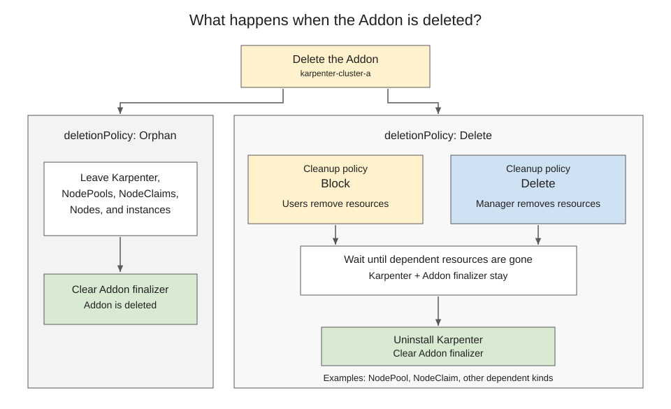

# KEP-NNNN: ClusterProfile AddOn API

<!-- toc -->
- [Release Signoff Checklist](#release-signoff-checklist)
- [Summary](#summary)
- [Motivation](#motivation)
  - [Terminology](#terminology)
  - [Existing Add-on Systems](#existing-add-on-systems)
  - [Relationship to the Work API](#relationship-to-the-work-api)
  - [Examples of AddOn Functionality](#examples-of-addon-functionality)
  - [Goals](#goals)
  - [Non-Goals](#non-goals)
- [Proposal](#proposal)
  - [API Overview](#api-overview)
  - [Users and Resources](#users-and-resources)
  - [Risks and Mitigations](#risks-and-mitigations)
- [Design Details](#design-details)
  - [API Types](#api-types)
  - [Validation and References](#validation-and-references)
  - [AddOn Manager Selection and AddOnClass Lifecycle](#addon-manager-selection-and-addonclass-lifecycle)
  - [Target Changes](#target-changes)
  - [Status Contract](#status-contract)
  - [Reconciliation](#reconciliation)
  - [Deletion](#deletion)
  - [Authorization and Scale](#authorization-and-scale)
  - [Functionality Implementation Patterns](#functionality-implementation-patterns)
    - [Reconciliation by the AddOn Manager](#reconciliation-by-the-addon-manager)
    - [Reconciliation by a dedicated controller](#reconciliation-by-a-dedicated-controller)
    - [Integration with an existing controller or service](#integration-with-an-existing-controller-or-service)
  - [Topology Examples](#topology-examples)
    - [Local cluster](#local-cluster)
    - [One hub and multiple spokes](#one-hub-and-multiple-spokes)
    - [Multiple hubs and one spoke](#multiple-hubs-and-one-spoke)
  - [Manifest Examples](#manifest-examples)
    - [OpenTelemetry Collector for a spoke cluster](#opentelemetry-collector-for-a-spoke-cluster)
    - [OpenTelemetry Collector for the local cluster](#opentelemetry-collector-for-the-local-cluster)
  - [Implementation Examples](#implementation-examples)
    - [Hosted Karpenter and dependent resources](#hosted-karpenter-and-dependent-resources)
  - [Test Plan](#test-plan)
      - [Prerequisite testing updates](#prerequisite-testing-updates)
      - [Unit tests](#unit-tests)
      - [Integration tests](#integration-tests)
      - [e2e tests](#e2e-tests)
  - [Graduation Criteria](#graduation-criteria)
    - [Alpha](#alpha)
    - [Beta](#beta)
    - [GA](#ga)
  - [Upgrade / Downgrade Strategy](#upgrade--downgrade-strategy)
  - [Version Skew Strategy](#version-skew-strategy)
- [Production Readiness Review Questionnaire](#production-readiness-review-questionnaire)
  - [Feature Enablement and Rollback](#feature-enablement-and-rollback)
  - [Rollout, Upgrade and Rollback Planning](#rollout-upgrade-and-rollback-planning)
  - [Monitoring Requirements](#monitoring-requirements)
  - [Dependencies](#dependencies)
  - [Scalability](#scalability)
  - [Troubleshooting](#troubleshooting)
- [Implementation History](#implementation-history)
- [Drawbacks](#drawbacks)
- [Alternatives](#alternatives)
- [References](#references)
<!-- /toc -->

## Release Signoff Checklist

<!--
**ACTION REQUIRED:** In order to merge code into a release, there must be an
issue in [kubernetes/enhancements] referencing this KEP and targeting a release
milestone **before the [Enhancement Freeze](https://git.k8s.io/sig-release/releases)
of the targeted release**.

For enhancements that make changes to code or processes/procedures in core
Kubernetes—i.e., [kubernetes/kubernetes], we require the following Release
Signoff checklist to be completed.

Check these off as they are completed for the Release Team to track. These
checklist items _must_ be updated for the enhancement to be released.
-->

Items marked with (R) are required *prior to targeting to a milestone / release*.

- [ ] (R) Enhancement issue in release milestone, which links to KEP dir in [kubernetes/enhancements] (not the initial KEP PR)
- [ ] (R) KEP approvers have approved the KEP status as `implementable`
- [ ] (R) Design details are appropriately documented
- [ ] (R) Test plan is in place, giving consideration to SIG Architecture and SIG Testing input (including test refactors)
  - [ ] e2e Tests for all Beta API Operations (endpoints)
  - [ ] (R) Ensure GA e2e tests meet requirements for [Conformance Tests](https://github.com/kubernetes/community/blob/master/contributors/devel/sig-architecture/conformance-tests.md)
  - [ ] (R) Minimum Two Week Window for GA e2e tests to prove flake free
- [ ] (R) Graduation criteria is in place
  - [ ] (R) [all GA Endpoints](https://github.com/kubernetes/community/pull/1806) must be hit by [Conformance Tests](https://github.com/kubernetes/community/blob/master/contributors/devel/sig-architecture/conformance-tests.md) within one minor version of promotion to GA
- [ ] (R) Production readiness review completed
- [ ] (R) Production readiness review approved
- [ ] "Implementation History" section is up-to-date for milestone
- [ ] User-facing documentation has been created in [kubernetes/website], for publication to [kubernetes.io]
- [ ] Supporting documentation—e.g., additional design documents, links to mailing list discussions/SIG meetings, relevant PRs/issues, release notes

<!--
**Note:** This checklist is iterative and should be reviewed and updated every time this enhancement is being considered for a milestone.
-->

[kubernetes.io]: https://kubernetes.io/
[kubernetes/enhancements]: https://git.k8s.io/enhancements
[kubernetes/kubernetes]: https://git.k8s.io/kubernetes
[kubernetes/website]: https://git.k8s.io/website

## Summary

The proposed ClusterProfile AddOn API lets users and applications request
functionality such as metrics collection, certificate management, or Node
provisioning for a Kubernetes cluster. An `AddOn` references the target
cluster's [`ClusterProfile`](../4322-cluster-inventory/README.md) and records
the request and its status. An `AddOnClass` selects the AddOn Manager
responsible for providing the functionality and can supply shared parameters.

Projects and platform teams can implement AddOn Managers and offer add-on
functionality through AddOnClasses. Clients that adopt the API can create,
update, and delete AddOns and read their status across implementations.
Multicluster platforms such as [Open Cluster Management](https://open-cluster-management.io/),
[KubeFleet](https://kubefleet.dev/), and [Clusternet](https://clusternet.io/)
could adopt the API as a foundation for an [add-on
catalog](#examples-of-addon-functionality). Each AddOn Manager defines its own
parameters, installation mechanisms, and access requirements.

The API also supports a [local cluster](#local-cluster). An AddOn Manager chooses how to
provide the requested functionality, including through hosted or serverless
implementations. For example, it can use components on the target or a hub,
or an external service.

## Motivation

SIG-Multicluster APIs cover several parts of multicluster management:

- [ClusterProfile](../4322-cluster-inventory/README.md) identifies a cluster and
  provides access information.
- [PlacementDecision](../5313-placement-decision-api/README.md) lists the
  clusters that a scheduler selected.
- The [Work
  API](https://github.com/kubernetes-sigs/work-api/blob/906c7aceb01dd261174b6eaa0687d283309a98df/docs/proposals/20210219-work-api.md)
  groups Kubernetes resource manifests for delivery to a managed cluster.
- The [About API](../2149-clusterid/README.md) stores cluster metadata, such as
  the cluster ID, in `ClusterProperty` resources.
- The [Multi-Cluster Services API](../1645-multi-cluster-services-api/README.md)
  makes Services exported from one cluster available to other clusters.

None of these APIs defines what functionality a cluster should have, such as
certificate management or metrics collection, or reports whether the cluster
provides it.

### Terminology

- Add-on: Software that [extends the functionality of a Kubernetes
  cluster](https://kubernetes.io/docs/concepts/cluster-administration/addons/),
  such as DNS, Pod networking, certificate management, or metrics collection.

- Add-on system: An API or tool that lets users request an add-on for a
  cluster and reports its status.

- Add-on catalog: The list of add-ons that an add-on system offers.

- AddOn: A namespaced API resource through which a user or application
  requests functionality for one ClusterProfile and observes its status.

- AddOnClass: A namespaced API resource through which a platform
  administrator selects an AddOn Manager and optionally supplies shared
  parameters.

- AddOn Manager: An entity selected by `AddOnClass.spec.manager.name` that
  provides the requested functionality, reports status, and manages the
  installation's lifecycle.

- Parameters object: An API object referenced through `parametersRef`
  to configure an AddOnClass or AddOn. The AddOn Manager defines the supported
  kinds and how shared and per-AddOn parameters combine.

- Managed installation: The resources and services managed for an AddOn
  to provide the requested functionality. These may include target-cluster
  resources, hub-hosted components, and external services.

- Target cluster: The Kubernetes cluster represented by the ClusterProfile
  referenced by an AddOn. The requested functionality is for this cluster;
  components providing it can run elsewhere.

- Hub cluster: A Kubernetes cluster hosting AddOn API resources that request
  functionality for other clusters.

- Spoke cluster: A target cluster for an AddOn hosted on a hub cluster. For
  example, an AddOn on a hub can target a ClusterProfile representing the
  spoke cluster `cluster-a`.

- Local cluster: The Kubernetes cluster hosting the AddOn API resources
  when an AddOn requests functionality for that same cluster.

These roles depend on the request. A cluster can be a spoke for an AddOn on
another cluster and the local cluster for an AddOn in its own API.

### Existing Add-on Systems

Add-on systems are common, but each requests add-ons, lists them, and reports
their status in its own way:

| Add-on system | Request | Catalog | Status |
| --- | --- | --- | --- |
| [Open Cluster Management](https://open-cluster-management.io/docs/developer-guides/addon/) | `ManagedClusterAddOn` | `ClusterManagementAddOn` | `ManagedClusterAddOn` conditions |
| [Amazon Elastic Kubernetes Service add-ons](https://docs.aws.amazon.com/eks/latest/userguide/eks-add-ons.html) | `CreateAddon` API | `DescribeAddonVersions` API | Add-on `status` and `health` |
| [Google Kubernetes Engine add-ons](https://cloud.google.com/kubernetes-engine/docs/reference/rest/v1/projects.locations.clusters#addonsconfig) | Cluster `addonsConfig` field | `AddonsConfig` fields | Cluster status |
| [Cluster API Add-on Provider for Helm](https://github.com/kubernetes-sigs/cluster-api-addon-provider-helm/blob/v0.6.4/docs/quick-start.md) | `HelmChartProxy` | None | `HelmReleaseProxy` status |
| [minikube](https://minikube.sigs.k8s.io/docs/commands/addons/) | `minikube addons enable` | `minikube addons list` | `minikube addons list` |

With AddOn and AddOnClass:

- Multicluster platforms can offer the add-ons of their add-on systems through
  AddOnClasses, so any client that supports the API can request them.
- Clients, such as developer portals and controllers that set up new clusters,
  can request add-ons and read their status through one API.

For example, an operator updating an OpenTelemetry Collector across a fleet
needs to distinguish a cluster where the new configuration was applied from
one still running the old configuration, and from one where the OpenTelemetry
Collector is current but unhealthy. The AddOn Manager reports these outcomes
through standard conditions on each AddOn.

### Relationship to the Work API

The Work API and higher-level controllers can address targeting,
configuration, status reporting, and cleanup for an add-on.

The ClusterProfile AddOn API standardizes requests for add-on functionality
and the lifecycle and status reported by the selected AddOn Manager.

| Question | Work API | ClusterProfile AddOn API |
| --- | --- | --- |
| What does the request describe? | Resource manifests to deliver to a managed cluster | Functionality offered by an AddOnClass for one ClusterProfile |
| Who chooses the implementation and configuration? | The caller or a higher-level controller composes the manifests | Users select an AddOnClass and optional per-AddOn parameters through an AddOn. Administrators specify the manager and optional shared parameters in the AddOnClass. That manager chooses how to provide the functionality. |
| What does status describe? | Individual resource conditions and Work-wide conditions summarizing the delivered manifests | Acceptance, reference resolution, and whether the entire managed installation is applied, current, and usable, including any hosted components or external services |
| What does the lifecycle cover? | Updates to the manifests and cleanup of the delivered resources | Changes to the request's AddOnClass, parameters, and current target, and cleanup of the managed installation |

An AddOn Manager can use Work to deliver resources and separately manage a
hosted controller or an external service. It remains responsible for AddOn
status and cleanup across those locations. This lets users request hosted or
serverless functionality without describing the components or choosing where
they run. The [functionality implementation
patterns](#functionality-implementation-patterns) and the
[hosted Karpenter
example](#hosted-karpenter-and-dependent-resources) illustrate
these choices.

### Examples of AddOn Functionality

An AddOn Manager could offer the following functionality through these
illustrative AddOnClasses.

| Example AddOnClass | Project | Functionality users could request for the target cluster |
| --- | --- | --- |
| `cert-manager` | [cert-manager](https://cert-manager.io/docs/) | Automated TLS certificate issuance and renewal. |
| `cilium` | [Cilium](https://docs.cilium.io/en/stable/overview/component-overview/) | Pod networking and network-policy enforcement. |
| `rook-ceph` | [Rook Ceph](https://www.rook.io/docs/rook/latest/Getting-Started/storage-architecture/) | Ceph-backed block, shared filesystem, and object storage. |
| `knative` | [Knative Serving](https://knative.dev/docs/serving/) and [Eventing](https://knative.dev/docs/eventing/) | Autoscaled HTTP services and event delivery, according to the components offered by the AddOnClass. |
| `vllm` | [vLLM](https://docs.vllm.ai/en/v0.20.2/serving/openai_compatible_server/) | LLM inference through an OpenAI-compatible HTTP endpoint. |

With wider adoption, an add-on catalog could list these offerings so users and
dashboards can request them through the same API. Catalog discovery and
distribution remain future work.

### Goals

1. Let users and applications request functionality for one ClusterProfile
   through a common API across AddOn Manager implementations.
2. Let a platform administrator offer add-on functionality through AddOnClasses
   that select an AddOn Manager and optional shared parameters, while users can
   supply parameters on each AddOn.
3. Let clients distinguish acceptance, reference resolution, application,
   whether an installation is current, and availability through standard
   conditions.
4. Define lifecycle behavior for changes to the AddOnClass, parameters, current
   target ClusterProfile, and deletion policy, including installations with
   components in several locations.

### Non-Goals

- Standardizing Helm, OCI, Git, Kustomize, OLM, or another installation format.
- Defining a version field or a parameter schema shared by different AddOn Managers.
- Selecting several clusters or generating AddOns from placement output. A
  user or another controller may create individual AddOns.
- Allowing an AddOn to reference a ClusterProfile or per-AddOn parameters in
  another namespace.
- Defining cluster credentials or the placement of AddOn Manager components.

## Proposal

### API Overview

The API uses Kubernetes resources, but client applications and AddOn Managers
can run inside or outside Kubernetes. For example, a hosted dashboard can create
AddOns and display their conditions, while an external AddOn Manager can
translate requests to the [Amazon Elastic Kubernetes Service add-on
API](#integration-with-an-existing-controller-or-service).


### Users and Resources

The API group is `multicluster.x-k8s.io`, and the proposed version is
`v1alpha1`. Both AddOnClass and AddOn are namespaced resources.

| Resource | Who writes the spec | Purpose |
| --- | --- | --- |
| `AddOnClass` | A platform administrator | Selects an AddOn Manager and optionally points to shared parameters |
| `AddOn` | A user or client application permitted to create AddOns | Requests and observes functionality for one ClusterProfile |
| `ClusterProfile` | A Cluster Manager | Identifies the target cluster and its current access configuration |

An inventory is a set of ClusterProfiles in one namespace. An AddOn belongs to
the same namespace as its target ClusterProfile. It can select an AddOnClass
from its own namespace or a shared namespace. One AddOnClass can serve many
AddOns, and one AddOn Manager can serve several AddOnClasses.

An AddOnClass or AddOn MAY carry the `multicluster.x-k8s.io/addon-manager`
label for filtering. When present on an AddOnClass, its value MUST match
`spec.manager.name`. The selected AddOn Manager MAY set the AddOn label to its
name when it reconciles the AddOn.

### Risks and Mitigations

| Risk | API behavior and operational boundary |
| --- | --- |
| An AddOn writer selects an AddOnClass with more authority than intended | By default, AddOn creation permits selection of any AddOnClass, including one in another namespace. Platform administrators can restrict selection through admission; see [Authorization and Scale](#authorization-and-scale). |
| A shared AddOnClass or its parameters change | The AddOn Manager reconciles all affected AddOns. Unusable parameters stop normal installation changes; existing installations remain in place unless an AddOn is being deleted and safe cleanup is possible. |
| An AddOnClass is deleted while AddOns use it | The DELETE webhook blocks deletion while any AddOn references the AddOnClass. If the AddOnClass nevertheless becomes unavailable, normal installation changes stop; the AddOn Manager that created an installation handles its cleanup through its finalizer. See [AddOn Manager Selection and AddOnClass Lifecycle](#addon-manager-selection-and-addonclass-lifecycle). |
| The ClusterProfile name comes to represent another cluster | The AddOn Manager verifies the installation for the current target before affirming its conditions. |
| Cleanup cannot reach a cluster or external service | The AddOn finalizer keeps deletion intent. A running AddOn Manager reports blocked cleanup. An authorized user may choose `Orphan` and leave the installation in place. |

## Design Details

### API Types

The Go types show the fields and JSON names. [Validation and
References](#validation-and-references) specifies the schema constraints, and
the [Status Contract](#status-contract) specifies initial conditions.

`AddOnClass` selects the AddOn Manager and optionally points to a shared
parameters object. An AddOn Manager defines the parameter kinds it accepts and
how AddOnClass and AddOn parameters combine.

```go
// +kubebuilder:resource:scope=Namespaced,categories=multicluster
// +kubebuilder:subresource:status
type AddOnClass struct {
	metav1.TypeMeta   `json:",inline"`
	metav1.ObjectMeta `json:"metadata,omitempty"`
	Spec              AddOnClassSpec   `json:"spec"`
	Status            AddOnClassStatus `json:"status,omitempty"`
}

type AddOnClassSpec struct {
	// +required
	Manager       AddOnManager                   `json:"manager"`
	ParametersRef *AddOnClassParametersReference `json:"parametersRef,omitempty"`
}

type AddOnManager struct {
	// +required
	Name string `json:"name"`
}

type AddOnClassParametersReference struct {
	Group     string `json:"group"` // Empty for a core API kind.
	Kind      string `json:"kind"`
	Name      string `json:"name"`
	Namespace string `json:"namespace,omitempty"`
}

type AddOnClassStatus struct {
	// +listType=map
	// +listMapKey=type
	Conditions []metav1.Condition `json:"conditions,omitempty"`
}
```

`AddOn` names one AddOnClass and one ClusterProfile. An AddOnClass reference
without a namespace resolves to the AddOn's namespace. `clusterProfileRef` is
immutable so that changing the named target requires a new AddOn.

```go
// +kubebuilder:resource:scope=Namespaced,categories=multicluster
// +kubebuilder:subresource:status
type AddOn struct {
	metav1.TypeMeta   `json:",inline"`
	metav1.ObjectMeta `json:"metadata,omitempty"`
	Spec              AddOnSpec   `json:"spec"`
	Status            AddOnStatus `json:"status,omitempty"`
}

type AddOnSpec struct {
	ClassRef          AddOnClassReference          `json:"classRef"`
	ClusterProfileRef AddOnClusterProfileReference `json:"clusterProfileRef"`
	ParametersRef     *AddOnParametersReference    `json:"parametersRef,omitempty"`
	DeletionPolicy    AddOnDeletionPolicy          `json:"deletionPolicy,omitempty"`
}

type AddOnClassReference struct {
	Name      string `json:"name"`
	Namespace string `json:"namespace,omitempty"`
}

type AddOnClusterProfileReference struct {
	Name string `json:"name"`
}

type AddOnParametersReference struct {
	Group string `json:"group"` // Empty for a core API kind.
	Kind  string `json:"kind"`
	Name  string `json:"name"`
}

type AddOnDeletionPolicy string

const (
	AddOnDeletionPolicyDelete AddOnDeletionPolicy = "Delete"
	AddOnDeletionPolicyOrphan AddOnDeletionPolicy = "Orphan"
)

type AddOnStatus struct {
	// +listType=map
	// +listMapKey=type
	Conditions []metav1.Condition `json:"conditions,omitempty"`
}
```

### Validation and References

The CRDs apply the following validation and defaulting rules without reading
another object:

| Field | Schema rule |
| --- | --- |
| `AddOnClass.spec.manager.name` | Lowercase DNS name with at least one dot, 3–63 characters, so it can also be used as a label value |
| Either `parametersRef.group` | Empty for the core API group, otherwise a DNS subdomain of at most 253 characters |
| Either `parametersRef.kind` | 1–63 ASCII letters, digits, or hyphens; starts with a letter and ends with a letter or digit |
| Either `parametersRef.name`, `AddOn.spec.classRef.name`, and `AddOn.spec.clusterProfileRef.name` | DNS subdomain of 1–253 characters |
| `AddOnClass.spec.parametersRef.namespace` and `AddOn.spec.classRef.namespace`, when present | DNS label of 1–63 characters |
| `AddOnClass.spec.manager` and `AddOn.spec.clusterProfileRef` | Immutable |
| `AddOn.spec.deletionPolicy` | `Delete` or `Orphan`; defaults to `Delete` |

Both `parametersRef` fields are optional; an implementation that needs no
parameters can accept AddOnClasses and AddOns that omit them. When present,
both parameter references require `group`, `kind`, and `name`. An AddOnClass
parameters reference includes `namespace` for a namespaced kind and omits it
for a cluster-scoped kind. The AddOn Manager checks that this agrees with the
kind's scope. The referenced object may be in a namespace other than the
AddOnClass's.

An AddOn parameters reference has no namespace field: it always names an object
in the AddOn's namespace. An AddOn can therefore use a shared AddOnClass
without granting the AddOnClass's author control over its per-AddOn parameters.
A missing, unsupported, or invalid AddOnClass parameters object makes the
AddOnClass `Accepted=False` with reason `InvalidParameters`.

### AddOn Manager Selection and AddOnClass Lifecycle

The AddOnClass's `spec.manager.name` selects its AddOn Manager regardless of
where that AddOn Manager runs. Each AddOn Manager uses a distinct name under a
domain it controls.

After observing an AddOnClass, its AddOn Manager MUST publish one `Accepted`
condition with the AddOnClass's generation in `observedGeneration`. `True`
means the AddOnClass and its parameters are usable, `False` means they are not,
and `Unknown` means the AddOn Manager cannot determine acceptance. Changing the
contents of its parameters object does not change the AddOnClass's generation;
the AddOn Manager re-evaluates those contents when it observes a change.

An AddOn's `spec.classRef` identifies its current AddOnClass. When the
AddOnClass exists, its `spec.manager.name` selects the AddOn Manager for normal
reconciliation. If the AddOnClass is missing, no AddOn Manager is selected
through that reference.

An AddOn writer may change `classRef.name` or `classRef.namespace` to another
AddOnClass served by the same AddOn Manager. The new AddOnClass becomes the
requested AddOnClass as soon as the AddOn update is admitted. The AddOn Manager
reconciles the existing installation against that request and reports progress
in conditions. An installation from the old request may remain while the new
request is unresolved or being applied.

An AddOn UPDATE admission webhook compares the resolved old and new AddOnClass
references. When the reference changes, the webhook reads both AddOnClasses and
rejects the update if either is absent, their `spec.manager.name` values
differ, or the new AddOnClass is terminating. Replacing an omitted namespace
with the AddOn's own namespace does not count as changing AddOnClasses.
Admission does not evaluate parameters specific to the AddOn Manager; the AddOn
Manager reports any problem with those in status. Changing only
`deletionPolicy` remains possible when an AddOnClass is missing.

The UPDATE webhook uses `failurePolicy: Fail` and needs read access to
AddOnClasses across namespaces. While it is unavailable, AddOn updates are
rejected, including updates that do not change `classRef`; status subresource
updates do not invoke it. Admission cannot protect against an AddOnClass
changing after an AddOn update, so the AddOn Manager checks again during
reconciliation that the AddOnClass selects it.

The selected AddOn Manager SHOULD keep a finalizer on an AddOnClass while any
AddOn references it, including AddOns in other namespaces. It removes that
finalizer when no AddOn references the AddOnClass. An AddOn Manager that
observes a terminating AddOnClass makes no normal installation changes through
it and reports the AddOnClass `Accepted=False` with reason `Deleting`.

An AddOnClass DELETE admission webhook MUST reject deletion while any AddOn in
any namespace references that AddOnClass's name and namespace through its
resolved `spec.classRef` (an omitted namespace resolves to the AddOn's
namespace). An AddOn being deleted or not yet accepted still counts until its
object is removed. Once an AddOn changes its AddOnClass reference, the old
AddOnClass is no longer protected by that AddOn. The webhook uses
`failurePolicy: Fail` and must be able to list AddOns across namespaces; a
listing failure rejects deletion.

Admission and reconciliation can race: an AddOn may be created after the DELETE
webhook lists referencing AddOns, or an AddOnClass may start terminating after
an AddOn Manager checks it. The AddOn Manager checks that the current
AddOnClass is usable before changing an installation and stops normal changes
when it observes the AddOnClass is missing or terminating.

### Target Changes

An AddOn acts on the cluster represented by the ClusterProfile currently at
`spec.clusterProfileRef.name` in the AddOn's namespace. The AddOn Manager uses
the current ClusterProfile and its access configuration when reconciling.
Before affirming `Applied`, `UpToDate`, or `Available`, it verifies the
installation for the current target. Until then, `Applied` and `UpToDate` are
`False` or `Unknown`; an installation for a former target cannot establish
`Available=True` on the current one. An access change may point to another
cluster. This API does not keep the old access configuration or require cleanup
on a former target.

### Status Contract

Both condition lists use list-map semantics keyed by `type`. The CRD defaults
the AddOnClass `Accepted` condition and all five standard AddOn conditions to
`Unknown` with reason `Pending`, the message `Waiting for AddOn Manager`, and
the epoch timestamp `1970-01-01T00:00:00Z` in `lastTransitionTime`. These
defaults have no `observedGeneration`.

The selected AddOn Manager MUST publish exactly one of each of the five
standard AddOn conditions after it begins reconciling an AddOn, including when
a reference other than the AddOnClass is unresolved. Conditions carry the
AddOn's generation in `observedGeneration`. Condition types specific to an
AddOn Manager are domain-prefixed.

| Condition | `True` | `False` | `Unknown` |
| --- | --- | --- | --- |
| `Accepted` | The requested AddOnClass can manage this AddOn | The AddOnClass rejects it, is terminating, or was observed missing | Acceptance cannot yet be determined |
| `ResolvedRefs` | The AddOnClass, its parameters, the target ClusterProfile, AddOn parameters, and required references specific to the AddOn Manager are usable | A required reference is missing, terminating, or invalid | Reference state cannot be determined |
| `Applied` | The entire requested installation has been confirmed applied for the current target | Application is known to be incomplete or failed | Whether the requested installation has been applied cannot be determined |
| `UpToDate` | The active installation for the current target matches the request and no older installation remains active | It is outdated, an older installation remains active, drift was found, or deletion is pending | Whether the installation is current cannot be determined |
| `Available` | An active installation for the current target is usable | The active installation is known to be unusable | Usability cannot be determined |

A condition's reason explains the particular cause. All five conditions are
current for the AddOn spec when they are present and their `observedGeneration`
equals `metadata.generation`. When all five are current and `True`, they report
that the installation requested by the AddOn is applied, current, and usable as
last observed by the AddOn Manager.

Changes to an AddOnClass or to either referenced parameters object's contents
do not advance the AddOn's generation. A matching `observedGeneration`
therefore shows which AddOn spec the AddOn Manager observed, but does not prove
that it has processed the latest referenced contents or is still running. The
API has no input revision or heartbeat field. For a generation-based check of
an individual update, a user can create a new immutable parameters object and
change that AddOn's `parametersRef`.

If the AddOnClass exists but it or its parameters are unusable, the selected
AddOn Manager reports `Accepted=False` and `ResolvedRefs=False` and makes no
normal installation changes. It reports `Applied=Unknown` and
`UpToDate=Unknown` when it cannot determine the current request from the
AddOnClass and its parameters, and reports `Available` from current evidence
about the installation, or `Unknown` if there is none. If the AddOnClass
disappears, no AddOn Manager is selected through `spec.classRef`. An AddOn
Manager still observing the AddOn may report the missing AddOnClass, but
conditions may also remain at their last reported values, even when their
`observedGeneration` matches the AddOn's generation. Deletion follows the
separate [cleanup rules](#deletion). When an AddOnClass becomes usable again,
including after recreation under the same namespace and name, its selected
AddOn Manager evaluates the current parameters and verifies the installation
before affirming `Applied` and `UpToDate`.

### Reconciliation

The AddOn Manager derives the request from the current AddOnClass, AddOn,
referenced parameter contents, target ClusterProfile, and
implementation-specific installation artifacts. It reconciles affected AddOns
when a reference or referenced contents changes. Until it verifies the new
request, it reports `Applied` and `UpToDate` as `False` or `Unknown`. An
incidental metadata or `resourceVersion` change alone does not change the
request.

`Applied=True` requires evidence that the entire installation was applied,
including components on a hub or in an external service. When delegating to
another API, the AddOn Manager checks that API's completion and installation
state. An Amazon Elastic Kubernetes Service integration, for example, could
inspect the [update
result](https://docs.aws.amazon.com/eks/latest/APIReference/API_DescribeUpdate.html)
and [add-on
state](https://docs.aws.amazon.com/eks/latest/APIReference/API_DescribeAddon.html).

Once an older installation stops serving during an update on the same target,
its old health result cannot establish availability of the new one.

| Observed installation state | `Applied` | `UpToDate` | `Available` |
| --- | --- | --- | --- |
| First install has not been applied | `False` | `False` | `Unknown` |
| New request exists; old installation still serves | `False` | `False` | `True` |
| New request applied; old installation still serves | `True` | `False` | `True` |
| Requested installation is current but unhealthy | `True` | `True` | `False` |
| Requested installation is current and usable | `True` | `True` | `True` |

The AddOn Manager writes related condition changes together.

### Deletion

The AddOn Manager MUST add its AddOn finalizer before changing any cluster or
external service. The policy controls the installation currently managed for
that AddOn:

| Policy | Finalizer removal |
| --- | --- |
| `Delete` (default) | The AddOn Manager MUST remove managed resources, including resources managed by delegated controllers or external services, before clearing its finalizer. |
| `Orphan` | The AddOn Manager stops managing the installation and leaves it in place, then clears its finalizer. |

An AddOn Manager may complete `Delete` cleanup for an installation it created
without a usable AddOnClass or AddOnClass parameters only when it can identify
the entire managed installation from existing installation state and verify
that all its resources and external state have been removed. If it cannot
establish complete removal, it MUST keep its AddOn finalizer. The API does not
prescribe a finalizer name or a handoff protocol if an AddOnClass is deleted
and recreated with another `spec.manager.name`.

During cleanup with a known scope, the AddOn Manager reports `UpToDate=False`
with reason `Deleting`, or `CleanupBlocked` if removal cannot proceed,
including when required access is lost. If unavailable AddOnClass inputs leave
the cleanup scope unknown, it reports `UpToDate=Unknown` with reason
`CleanupBlocked`. `Available` continues to report observed usability. An
authorized user can switch to `Orphan` while deletion is pending; the AddOn
Manager that added the finalizer then clears it even if the AddOnClass is
unavailable.

### Authorization and Scale

By default, a user who can create an AddOn can select any AddOnClass, including
one in another namespace, even without read permission on that AddOnClass. The
AddOn can also select a ClusterProfile and supported parameters in its own
namespace without granting the writer read access to those objects. Platform
administrators control AddOnClass creation and can restrict permitted
AddOnClass and AddOn combinations through admission policy. This API does not
define per-AddOnClass grants.

An AddOn Manager reads references with its own permissions. It needs to observe
AddOns in namespaces that can select its AddOnClasses or carry its finalizer
for cleanup. AddOn status MUST NOT contain Secret contents or otherwise reveal
contents the AddOn writer is not authorized to read.

A shared AddOnClass or parameters change can prompt reconciliation of many
AddOns. Each AddOn stores five standard conditions.

### Functionality Implementation Patterns

The AddOn Manager turns each assigned AddOn request into functionality for its
target cluster. It can perform that work itself, manage a controller dedicated
to the AddOn, or translate the request to an existing controller or service.
These approaches can be combined. The AddOn Manager remains responsible for
reporting AddOn status and managing the installation's lifecycle, as described
in [Reconciliation](#reconciliation) and [Deletion](#deletion).

Controller sharing and controller placement are separate choices from the
integration mechanism:

| Controller sharing | Requests served |
| --- | --- |
| Shared across AddOns | Several AddOns, whether they target the same cluster or different clusters |
| Dedicated per AddOn | One AddOn |

A controller with either sharing model can run in any of the locations below.
Here, a hosted controller runs outside the target cluster, including on a hub.

| Controller location | Representative access to target resources |
| --- | --- |
| Cluster hosting the AddOn API resources | Accesses a spoke cluster's API remotely; accesses the same API when the target is local |
| Another Kubernetes cluster | Accesses the target API remotely from a cluster distinct from both the API host and the target |
| Runtime outside Kubernetes | Accesses the target API remotely from an external process or service |
| Target cluster | Accesses that cluster's API locally |

For a local AddOn, the cluster hosting the API resources and the target cluster
are the same location.

Resource delivery and configuration are additional implementation choices. An
AddOn Manager can use Work to deliver manifests to the target or integrate with
an Open Cluster Management
[`AddOnTemplate`](https://open-cluster-management.io/docs/developer-guides/addon/#build-an-addon-with-addon-template)
to define agent manifests for deployment there. The [existing add-on
systems](#existing-add-on-systems) provide other integration options.

#### Reconciliation by the AddOn Manager

The AddOn Manager can itself reconcile the resources that provide the requested
functionality. In this example, it runs on a hub cluster and acts as a controller
shared across two AddOns: `addon-a` targets the spoke `cluster-a`, and `addon-b`
targets the spoke `cluster-b`. Both requests are served by the same controller.

An implementation could use
[multicluster-runtime](https://github.com/kubernetes-sigs/multicluster-runtime)
to watch and reconcile resources across these spoke clusters.


#### Reconciliation by a dedicated controller

The AddOn Manager manages a controller instance for each AddOn. Each controller
reconciles the resources that provide functionality for that AddOn's target.
In the diagram, `addon-a` and `addon-b` have separate controllers on the hub;
the placement options above also apply to these controllers.

The [hosted Karpenter
example](#hosted-karpenter-and-dependent-resources) illustrates
remote reconciliation from a controller on the hub.


#### Integration with an existing controller or service

The AddOn Manager can manage an integration resource or service request handled
by an existing controller or service. It translates each AddOn request into
that API and observes the resulting installation state to report AddOn status.
The diagram shows these responsibilities without fixing their execution
locations.

For example, an AddOn Manager running on the target can create a HelmRelease
there. A shared
[Flux helm-controller](https://fluxcd.io/flux/components/helm/) reconciles that
and other HelmReleases, managing the resources that provide the requested
functionality. An AddOn Manager running outside both the hub and target can
instead use the [Amazon Elastic Kubernetes Service add-on
API](https://docs.aws.amazon.com/eks/latest/APIReference/API_CreateAddon.html)
and observe its update results and add-on state.


### Topology Examples

#### Local cluster

The API also works on a single cluster. AddOn
`platform-system/otel-collector-local` selects AddOnClass
`platform-system/otel-collector` and ClusterProfile
`platform-system/local-cluster`, whose access provider points to that cluster's
own API server. The AddOnClass supplies shared OpenTelemetry Collector
parameters, and the AddOn references per-AddOn parameters. The
OpenTelemetry Collector AddOn Manager reconciles this request and reports the
installation's status in the AddOn.
The [local manifest example](#opentelemetry-collector-for-the-local-cluster)
gives the configuration.


#### One hub and multiple spokes

A platform administrator offers metrics collection through AddOnClass
`platform-system/otel-collector` on a hub cluster. This AddOnClass selects the
OpenTelemetry Collector AddOn Manager. AddOn
`fleet-prod/otel-collector-cluster-a` selects this AddOnClass and requests
metrics collection for the spoke represented by ClusterProfile
`fleet-prod/cluster-a` with per-AddOn parameters. The [spoke manifest
example](#opentelemetry-collector-for-a-spoke-cluster) defines these resources.

A second AddOn can select the same AddOnClass for `fleet-prod/cluster-b` with
different parameters. To update only `cluster-a`, the user creates a parameters
object with the new image tag and changes the first AddOn's `parametersRef`.
Its `Applied`, `UpToDate`, and `Available` conditions distinguish an update in
progress from a current, usable installation.

The hub holds the shared AddOnClass and parameters in `platform-system`, and
the AddOns, per-AddOn parameters, and ClusterProfiles in `fleet-prod`. The
OpenTelemetry Collector AddOn Manager reports status to each AddOn and manages
an OpenTelemetry Collector installation on each spoke cluster.


#### Multiple hubs and one spoke

A cluster can receive add-ons requested through its own API and through more
than one hub API. In this example, `cluster-a` is a spoke for requests from hub
clusters A and B and the local cluster for a request in its own API. It receives
three different add-ons:

| API host | AddOn | ClusterProfile | Requested functionality |
| --- | --- | --- | --- |
| Local cluster: `cluster-a` | `platform-system/otel-collector-local` | `platform-system/local-cluster` | Metrics collection through an OpenTelemetry Collector |
| Hub cluster A | `fleet-prod/cert-manager-cluster-a` | `fleet-prod/cluster-a` | Certificate management through cert-manager |
| Hub cluster B | `fleet-prod/cilium-cluster-a` | `fleet-prod/cluster-a` | Pod networking through Cilium |

The ClusterProfiles in the three APIs all represent the same `cluster-a`.
Each AddOn references an AddOnClass and parameters in its own API. Each selected
AddOn Manager reports status to that AddOn and manages the corresponding
installation on `cluster-a`. Requests and status remain independent in the
three APIs.


### Manifest Examples

The following examples use illustrative parameter APIs defined by AddOn Managers.

#### OpenTelemetry Collector for a spoke cluster

AddOnClass `platform-system/otel-collector`
selects the OpenTelemetry Collector AddOn Manager and shared parameters. Each
AddOn supplies an image tag, cluster name, and resource attribute through a
parameters object in its own namespace.

```yaml
apiVersion: observability.example.io/v1alpha1
kind: OpenTelemetryCollectorParameters
metadata:
  name: collector-shared-parameters
  namespace: platform-system
spec:
  image:
    repository: otel/opentelemetry-collector-contrib
  replicas: 1
  prometheusRemoteWrite:
    endpoint: https://prometheus.monitoring.example.com/api/v1/write
    tls:
      enabled: true
---
apiVersion: multicluster.x-k8s.io/v1alpha1
kind: AddOnClass
metadata:
  name: otel-collector
  namespace: platform-system
  labels:
    multicluster.x-k8s.io/addon-manager: collector.observability.example.io
spec:
  manager:
    name: collector.observability.example.io
  parametersRef:
    group: observability.example.io
    kind: OpenTelemetryCollectorParameters
    namespace: platform-system
    name: collector-shared-parameters
---
apiVersion: observability.example.io/v1alpha1
kind: OpenTelemetryCollectorParameters
metadata:
  name: cluster-a-parameters
  namespace: fleet-prod
spec:
  image:
    tag: "0.128.0"
  clusterName: cluster-a
  resourceAttributes:
    deployment.environment.name: production
---
apiVersion: multicluster.x-k8s.io/v1alpha1
kind: AddOn
metadata:
  name: otel-collector-cluster-a
  namespace: fleet-prod
spec:
  classRef:
    name: otel-collector
    namespace: platform-system
  clusterProfileRef:
    name: cluster-a
  parametersRef:
    group: observability.example.io
    kind: OpenTelemetryCollectorParameters
    name: cluster-a-parameters
```

The OpenTelemetry Collector AddOn Manager combines these parameter objects to
configure metrics collection and forwarding for `cluster-a`. The endpoint and
any credentials needed for remote write are supplied separately from cluster
access; this API does not provision the endpoint.

A completed `cluster-a` AddOn could carry the label and report the following
status:

```yaml
metadata:
  labels:
    multicluster.x-k8s.io/addon-manager: collector.observability.example.io
status:
  conditions:
    - type: Accepted
      status: "True"
      reason: Accepted
      message: "AddOnClass accepts this AddOn"
      observedGeneration: 1
      lastTransitionTime: "2026-09-25T09:00:00Z"
    - type: ResolvedRefs
      status: "True"
      reason: ResolvedRefs
      message: "AddOnClass, ClusterProfile, and parameters are resolved"
      observedGeneration: 1
      lastTransitionTime: "2026-09-25T09:00:00Z"
    - type: Applied
      status: "True"
      reason: InstallationApplied
      message: "Requested OpenTelemetry Collector installation applied on cluster-a"
      observedGeneration: 1
      lastTransitionTime: "2026-09-25T09:00:00Z"
    - type: UpToDate
      status: "True"
      reason: InstallationUpToDate
      message: "OpenTelemetry Collector installation matches the requested configuration"
      observedGeneration: 1
      lastTransitionTime: "2026-09-25T09:00:00Z"
    - type: Available
      status: "True"
      reason: InstallationAvailable
      message: "OpenTelemetry Collector is usable on cluster-a"
      observedGeneration: 1
      lastTransitionTime: "2026-09-25T09:00:00Z"
```

#### OpenTelemetry Collector for the local cluster

ClusterProfile `platform-system/local-cluster` points to
`https://kubernetes.default.svc.cluster.local:443`. The local AddOn selects
the same `platform-system/otel-collector` AddOnClass, so only its per-AddOn
parameters and AddOn differ from the fleet request. A `secretreader` access
provider could obtain cluster credentials from a configured Secret; the
[Cluster Inventory API access provider
design](../4322-cluster-inventory/README.md#access-provider-plugin-design)
defines that mechanism.

```yaml
apiVersion: observability.example.io/v1alpha1
kind: OpenTelemetryCollectorParameters
metadata:
  name: local-cluster-parameters
  namespace: platform-system
spec:
  image:
    tag: "0.128.0"
  clusterName: local-cluster
  resourceAttributes:
    deployment.environment.name: development
---
apiVersion: multicluster.x-k8s.io/v1alpha1
kind: AddOn
metadata:
  name: otel-collector-local
  namespace: platform-system
spec:
  classRef:
    name: otel-collector
  clusterProfileRef:
    name: local-cluster
  parametersRef:
    group: observability.example.io
    kind: OpenTelemetryCollectorParameters
    name: local-cluster-parameters
```

### Implementation Examples

#### Hosted Karpenter and dependent resources

In this example, the AddOn `karpenter-cluster-a` in namespace `fleet-prod`
references the ClusterProfile `cluster-a` in the same namespace. That
ClusterProfile represents the spoke cluster `cluster-a`.

The AddOn Manager installs the Karpenter controller on the hub and configures the
required Karpenter CRDs on `cluster-a`. The controller has credentials and
permissions for the target Kubernetes API and the cloud provider to provision
Nodes.
There are no Karpenter controller Pods on `cluster-a`, but it still holds the
CRDs, NodePools, NodeClaims, and user Pods that the controller works with. The
controller can start before the target has any Nodes and provision capacity for
those Pods.


```yaml
apiVersion: multicluster.x-k8s.io/v1alpha1
kind: AddOnClass
metadata:
  name: karpenter
  namespace: fleet-prod
spec:
  manager:
    name: karpenter.autoscaling.example.io
---
apiVersion: autoscaling.example.io/v1alpha1
kind: KarpenterParameters
metadata:
  name: karpenter-cluster-a
  namespace: fleet-prod
spec:
  dependentResourceCleanupPolicy: Block
---
apiVersion: multicluster.x-k8s.io/v1alpha1
kind: AddOn
metadata:
  name: karpenter-cluster-a
  namespace: fleet-prod
spec:
  classRef:
    name: karpenter
  clusterProfileRef:
    name: cluster-a
  parametersRef:
    group: autoscaling.example.io
    kind: KarpenterParameters
    name: karpenter-cluster-a
  deletionPolicy: Delete
```

Karpenter must remain running while NodeClaim finalizers drain Nodes and
terminate cloud instances. Deleting a NodePool cascades to its NodeClaims;
directly created NodeClaims need separate deletion. In this example, the
AddOn Manager's `dependentResourceCleanupPolicy` setting determines who requests
deletion of dependent resources: `Block` waits for users to request deletion,
while `Delete` makes the AddOn Manager request deletion. With
`deletionPolicy: Delete`, the AddOn Manager removes Karpenter only after those
resources on `cluster-a` are gone. With `deletionPolicy: Orphan`, it leaves the
installation and target resources in place.



### Test Plan

##### Prerequisite testing updates

This out-of-tree API needs no Kubernetes core test changes before
implementation. The API project needs CRD and admission tests; each AddOn
Manager needs tests for its installation mechanism.

##### Unit tests

AddOn Manager tests cover status transitions, AddOnClass changes within the
same AddOn Manager, target changes, parameter changes, and cleanup. They use
the condition meanings and scenarios below.

##### Integration tests

CRD tests cover scope, policy and initial condition defaults, immutability,
reference syntax and namespace rules, typed parameters references including
the empty core API group, and the condition list-map shape. Admission tests cover:

- AddOn updates between AddOnClasses with the same AddOn Manager, rejection of a
  different AddOn Manager, missing AddOnClasses, an omitted versus explicit local
  AddOnClass namespace, and a missing old AddOnClass.
- Status subresource updates, policy-only changes when an AddOnClass is missing,
  and the UPDATE webhook's failure behavior.
- AddOnClass deletion with a referencing AddOn in another namespace, an AddOn being
  deleted or not yet accepted, an AddOnClass change in progress, a same-named AddOnClass
  in another namespace, list failure, and webhook unavailability.

##### e2e tests

AddOn Manager conformance tests cover:

1. An AddOn Manager accepts an AddOnClass and writes five conditions on its AddOns.
   An AddOnClass reference without a namespace resolves to the AddOn's namespace.
   AddOnClasses in different inventories may share a name and AddOn Manager while
   using different parameters; a shared AddOnClass may live in a third namespace.
2. Changes to AddOn parameters references and to either referenced parameters
   object's contents reconcile the affected AddOns. Missing or invalid
   references report `ResolvedRefs=False`; invalid AddOnClass parameters report
   AddOnClass `Accepted=False` even when its generation is unchanged.
3. Partial application, an old installation still serving, health failure,
   drift, target access loss, and AddOn Manager restart produce the distinct
   `Applied`, `UpToDate`, and `Available` outcomes in the status contract.
4. When a ClusterProfile's access configuration points to another cluster,
   including after recreation under the same name, the AddOn Manager verifies
   the current target; an installation for a former target does not establish
   that the current one is available.
5. A missing or terminating AddOnClass causes no new installation changes. When the
   AddOnClass disappears, conformance does not require a status update from an AddOn
   Manager no longer selected by the reference; last reported conditions may
   remain. Recreating the AddOnClass under the same name prompts evaluation of its
   current AddOn Manager and parameters.
6. An AddOnClass change within the same AddOn Manager makes the new AddOnClass the current
   request. The existing installation may remain while the new request is
   unresolved or being applied; invalid new parameters prevent normal
   installation changes and conditions report that progress.
7. With a missing AddOnClass or invalid AddOnClass parameters, `Delete` and `Orphan`
   follow the [Deletion](#deletion) rules.

### Graduation Criteria

#### Alpha

- Define the two CRDs and admission behavior, and implement one AddOn Manager.
- Exercise AddOn Manager selection, parameters, status, target changes, and
  deletion through the Test Plan.

#### Beta

- At least two independent AddOn Managers with different installation
  mechanisms and one client application, such as a developer portal, using the
  ClusterProfile AddOn API. For AddOns that each AddOn Manager reconciles, the
  client application uses only their [five standard
  conditions](#status-contract) to determine whether the requested
  installation is applied, current, and usable.
- Publish a conformance suite for the shared status, AddOn Manager selection,
  and deletion contract. Run it against these AddOn Managers.
- Measure failure and scale limits, including access loss, AddOn Manager restart,
  parameter changes, and blocked cleanup. Update the status and deletion rules
  where AddOn Managers interpret them differently in these tests.

#### GA

- Keep status and deletion semantics compatible across supported API versions.
  Test conversion of persisted AddOn specs and conditions if a new storage
  version is introduced.
- Show that independent AddOn Managers pass the conformance suite and follow
  the [Version Skew Strategy](#version-skew-strategy). Incorporate production
  feedback before declaring the API stable.

### Upgrade / Downgrade Strategy

### Version Skew Strategy

An AddOn Manager that cannot interpret current parameters does not report
`ResolvedRefs=True` or `Applied=True` for them. An implementation supporting
several API versions MUST preserve the AddOn spec, conditions, and deletion
intent when converting objects.

## Production Readiness Review Questionnaire

### Feature Enablement and Rollback

###### How can this feature be enabled / disabled in a live cluster?

###### Does enabling the feature change any default behavior?

No core Kubernetes component consumes these resources. An AddOn has no
installation effect without an AddOn Manager for its selected AddOnClass.

###### Can the feature be disabled once it has been enabled (i.e. can we roll back the enablement)?

Deleting an AddOn with `deletionPolicy: Delete` (the default) requests removal
of its managed installation. With `Orphan`, the installation remains in place;
see [Deletion](#deletion).

Stopping an AddOn Manager suspends reconciliation without removing its AddOns
or installations.

###### What happens if we reenable the feature if it was previously rolled back?

A returning AddOn Manager checks the current AddOnClass, parameters, target,
and installation before affirming conditions. It can continue deletion from the
finalizers still in place. An AddOnClass finalizer remains pending until the
AddOn Manager checks that no AddOn references it. Deleted API objects cannot be
reconstructed from an installation alone.

###### Are there any tests for feature enablement/disablement?

The Test Plan covers AddOn Manager restarts, last-known status, changed inputs, and
finalizers. There is no core feature-gate test.

### Rollout, Upgrade and Rollback Planning

###### How can a rollout or rollback fail? Can it impact already running workloads?

An unavailable AddOn UPDATE webhook rejects AddOn updates, and an unavailable
AddOnClass DELETE webhook rejects AddOnClass deletion. An AddOn Manager outage
leaves status last-known and prevents installation changes and finalizer
cleanup. Loss of target access or invalid references can leave an installation
outdated or delay deletion; neither failure by itself requests uninstallation.
Core workloads do not acquire a new behavior from this API.

###### What specific metrics should inform a rollback?

Condition counts and reasons show unresolved references, incomplete
application, drift, unavailable installations, and blocked cleanup. AddOn Manager
availability, admission errors, reconciliation latency, and remote API errors
are implementation-specific signals. The API sets no universal threshold.

###### Were upgrade and rollback tested? Was the upgrade->downgrade->upgrade path tested?

###### Is the rollout accompanied by any deprecations and/or removals of features, APIs, fields of API types, flags, etc.?

No.

### Monitoring Requirements

###### How can an operator determine if the feature is in use by workloads?

Each AddOn represents one requested installation for the ClusterProfile in its
namespace. `spec.classRef` names the requested AddOnClass; the AddOnClass's
`spec.manager.name` selects the AddOn Manager while the AddOnClass exists. An
AddOnClass alone does not mean an installation exists.

###### How can someone using this feature know that it is working for their instance?

The AddOnClass's `Accepted` condition shows whether its AddOn Manager accepts
its shared configuration. The AddOn's five conditions show whether the request
is accepted, references are usable, and the installation is applied, current,
and available. The user also checks AddOn Manager health when status may be
stale.

###### What are the reasonable SLOs (Service Level Objectives) for the enhancement?

The API imposes no common reconciliation-time or availability target because
installation mechanisms and target access paths vary. Each AddOn Manager sets its
own numeric service objectives.

###### What are the SLIs (Service Level Indicators) an operator can use to determine the health of the service?

AddOn Managers can measure availability, reconciliation latency, admission
errors, remote API failures, and AddOn counts by condition and reason. Metric
names are not standardized.

###### Are there any missing metrics that would be useful to have to improve observability of this feature?

No common liveness or input-freshness metric is defined. Each implementation
provides its own signals for those needs.

### Dependencies

###### Does this feature depend on any specific services running in the cluster?

Normal installation reconciliation needs its selected AddOnClass, a
ClusterProfile in the AddOn's namespace, an AddOn Manager for the AddOnClass,
and any referenced parameters. The admission webhooks must be available for
AddOn updates and AddOnClass deletion, with certificates trusted by the API
server. The AddOnClass DELETE webhook needs permission to list AddOns across
namespaces. An AddOn Manager may also depend on an installation mechanism or
an access provider. Examples include:

| Dependency role | Example integration |
| --- | --- |
| Installation mechanism | Open Cluster Management add-on functionality, Flux `helm-controller`, or the Amazon Elastic Kubernetes Service add-on API |
| Target access | The ClusterProfile `secretreader` access provider, which obtains credentials from a configured Secret |

### Scalability

###### Will enabling / using this feature result in any new API calls?

AddOn Managers watch AddOns, their AddOnClasses, targets, and referenced
parameters, then update status and finalizers. AddOn UPDATE admission reads the
old and new AddOnClasses for an AddOnClass change. AddOnClass DELETE admission
lists AddOns across namespaces to find references in `spec.classRef`.

###### Will enabling / using this feature result in introducing new API types?

Yes. AddOnClass and AddOn are new namespaced types. Each requested target
installation has one AddOn; an AddOnClass can be shared across AddOns and
inventory namespaces.

###### Will enabling / using this feature result in any new calls to the cloud provider?

The API itself makes none. An AddOn Manager may call a cloud provider as part
of its installation mechanism.

###### Will enabling / using this feature result in increasing size or count of the existing API objects?

No existing Kubernetes type gains fields or instances directly from this API.
AddOn Managers may create implementation-specific resources.

###### Will enabling / using this feature result in increasing time taken by any operations covered by existing SLIs/SLOs?

Yes, indirectly, depending on the AddOn Manager's implementation and load.
AddOn Manager API traffic and installation activity may increase API request
latency or Pod startup latency through shared resource contention. The admission
webhooks add latency only to AddOn updates and AddOnClass deletion, which are
outside the [existing Kubernetes API request latency SLOs](https://github.com/kubernetes/community/blob/master/sig-scalability/slos/api_call_latency.md).

###### Will enabling / using this feature result in non-negligible increase of resource usage (CPU, RAM, disk, IO, ...) in any components?

A shared AddOnClass or parameters change may reconcile every AddOn that uses
it. The AddOnClass deletion lookup grows with the number of AddOns.
Installation size and target access patterns determine AddOn Manager watch
state, API reads, and status writes.

###### Can enabling / using this feature result in resource exhaustion of some node resources (PIDs, sockets, inodes, etc.)?

The API requires no per-AddOn process or socket. An AddOn Manager's remote
connections, polling, and installation resources depend on its implementation
and are not bounded by the API.

### Troubleshooting

###### How does this feature react if the API server and/or etcd is unavailable?

AddOn Managers cannot read current inputs or publish status, and admission cannot
complete. Existing installations are not uninstalled by that outage. Status
remains last-known and finalizers keep deletion intent.

###### What are other known failure modes?

Default `Pending` conditions mean no AddOn Manager has reported an observation.
Conditions and reasons distinguish unresolved references, incomplete
application, outdated or unavailable installations, and blocked cleanup. A
stopped AddOn Manager leaves last-known conditions, so AddOn Manager health is
needed to identify stale status.

###### What steps should be taken if SLOs are not being met to determine the problem?

Each AddOn Manager defines its own threshold. Its health and remote-access
signals distinguish an outage from a request that is invalid, outdated,
unavailable, or blocked on cleanup. AddOn conditions describe the last state it
observed.

## Implementation History

## Drawbacks

An AddOn Manager needs to observe AddOnClasses and parameter objects as well as
AddOns. AddOn Managers integrating an existing installation API must translate
its state into the common conditions. Parameter schemas and installation
support remain specific to each AddOn Manager. Admission also adds an
availability dependency for AddOn updates and AddOnClass deletion.

## Alternatives

Extending Work with AddOnClass selection, parameters defined by the AddOn
Manager, and the AddOn installation lifecycle is an alternative. A separate
AddOn API lets managers backed by different installation mechanisms offer the
same request, lifecycle, and status interface.

A cluster-scoped AddOnClass would let every inventory select the same
AddOnClass without a namespace in `classRef`, but creating or changing it would
require cluster-wide permissions.

Users could use the [existing add-on systems](#existing-add-on-systems) or
other installation APIs directly. For example, [Flux
HelmRelease](https://fluxcd.io/flux/components/helm/helmreleases/) can use
`spec.kubeConfig` for a remote cluster. An AddOn Manager could integrate with
each of these APIs. A client using them directly must interpret each target
reference and status model; an AddOn gives it one ClusterProfile target and
one condition contract.

Putting `manager.name` in each AddOn's spec would remove AddOnClass but would
let every AddOn writer select an AddOn Manager and would provide no
AddOnClass-level shared configuration.

## References

- [Cluster Inventory API (KEP-4322)](../4322-cluster-inventory/README.md)
- [ClusterProfile API overview](https://multicluster.sigs.k8s.io/concepts/cluster-profile-api/)
- [Gateway API class pattern](https://gateway-api.sigs.k8s.io/reference/api-spec/main/spec/)
- [Kubernetes API conventions](https://github.com/kubernetes/community/blob/master/contributors/devel/sig-architecture/api-conventions.md)
- [Cluster API ControlPlane contract](https://cluster-api.sigs.k8s.io/developer/providers/contracts/control-plane)
- [Cluster API ClusterClass changes](https://cluster-api.sigs.k8s.io/tasks/experimental-features/cluster-class/change-clusterclass)
- [Open Cluster Management add-on configuration status](https://open-cluster-management.io/docs/getting-started/installation/addon-management/)
- [OpenTelemetry Kubernetes resource attributes](https://opentelemetry.io/docs/specs/semconv/resource/k8s/)
- [OpenTelemetry deployment environment attribute](https://opentelemetry.io/docs/specs/semconv/registry/attributes/deployment/)
- [OpenTelemetry Collector resource processor](https://github.com/open-telemetry/opentelemetry-collector-contrib/blob/main/processor/resourceprocessor/README.md)
- [OpenTelemetry Collector Prometheus remote write exporter](https://github.com/open-telemetry/opentelemetry-collector-contrib/blob/v0.128.0/exporter/prometheusremotewriteexporter/README.md)
- [Karpenter NodeClaims](https://karpenter.sh/docs/concepts/nodeclaims/)
