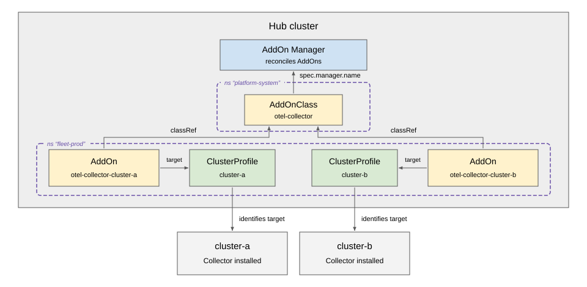
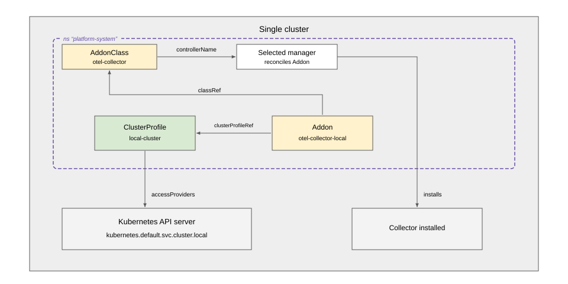
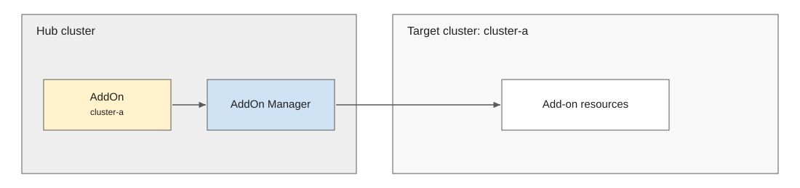
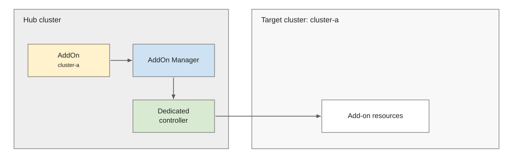
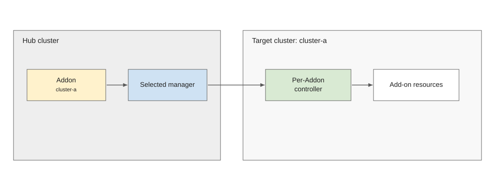
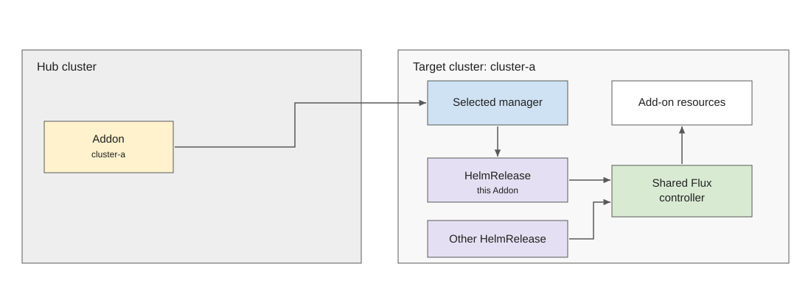
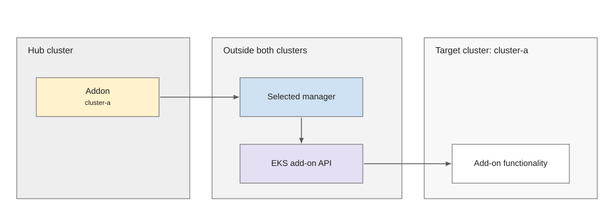
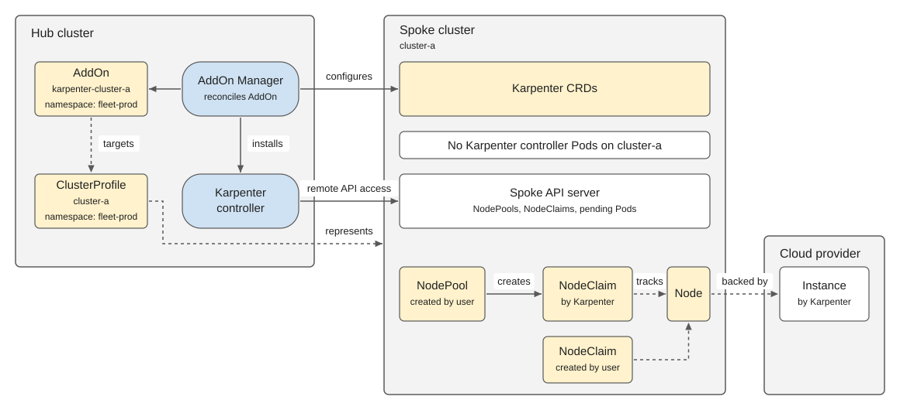

# KEP-NNNN: Multicluster Addon API

<!-- toc -->
- [Release Signoff Checklist](#release-signoff-checklist)
- [Summary](#summary)
- [Motivation](#motivation)
  - [Goals](#goals)
  - [Non-Goals](#non-goals)
- [Proposal](#proposal)
  - [Users and Resources](#users-and-resources)
  - [Example: Manage Collectors Across Clusters](#example-manage-collectors-across-clusters)
  - [Example: Addon on the Local Cluster](#example-addon-on-the-local-cluster)
  - [Risks and Mitigations](#risks-and-mitigations)
- [Design Details](#design-details)
  - [API Types](#api-types)
  - [Validation and References](#validation-and-references)
  - [Example: Shared Class and Per-Cluster Parameters](#example-shared-class-and-per-cluster-parameters)
  - [Manager Selection and Class Lifecycle](#manager-selection-and-class-lifecycle)
  - [Target Identity](#target-identity)
  - [Status Contract](#status-contract)
  - [Reconciliation](#reconciliation)
  - [Deletion](#deletion)
  - [Authorization and Scale](#authorization-and-scale)
  - [Implementation Patterns](#implementation-patterns)
    - [Direct management from the hub](#direct-management-from-the-hub)
    - [Dedicated controller on the hub](#dedicated-controller-on-the-hub)
    - [Dedicated controller on the target](#dedicated-controller-on-the-target)
    - [Shared controller on the target](#shared-controller-on-the-target)
    - [External add-on service](#external-add-on-service)
  - [API Examples](#api-examples)
  - [Implementation Example: Karpenter and Dependent Resources](#implementation-example-karpenter-and-dependent-resources)
  - [Test Plan](#test-plan)
      - [Prerequisite testing updates](#prerequisite-testing-updates)
      - [Unit tests](#unit-tests)
      - [Integration tests](#integration-tests)
      - [e2e tests](#e2e-tests)
  - [Graduation Criteria](#graduation-criteria)
    - [Alpha](#alpha)
    - [Beta](#beta)
    - [GA](#ga)
  - [Upgrade / Downgrade Strategy](#upgrade--downgrade-strategy)
  - [Version Skew Strategy](#version-skew-strategy)
- [Production Readiness Review Questionnaire](#production-readiness-review-questionnaire)
  - [Feature Enablement and Rollback](#feature-enablement-and-rollback)
  - [Rollout, Upgrade and Rollback Planning](#rollout-upgrade-and-rollback-planning)
  - [Monitoring Requirements](#monitoring-requirements)
  - [Dependencies](#dependencies)
  - [Scalability](#scalability)
  - [Troubleshooting](#troubleshooting)
- [Implementation History](#implementation-history)
- [Drawbacks](#drawbacks)
- [Alternatives](#alternatives)
- [References](#references)
<!-- /toc -->

## Release Signoff Checklist

<!--
**ACTION REQUIRED:** In order to merge code into a release, there must be an
issue in [kubernetes/enhancements] referencing this KEP and targeting a release
milestone **before the [Enhancement Freeze](https://git.k8s.io/sig-release/releases)
of the targeted release**.

For enhancements that make changes to code or processes/procedures in core
Kubernetes—i.e., [kubernetes/kubernetes], we require the following Release
Signoff checklist to be completed.

Check these off as they are completed for the Release Team to track. These
checklist items _must_ be updated for the enhancement to be released.
-->

Items marked with (R) are required *prior to targeting to a milestone / release*.

- [ ] (R) Enhancement issue in release milestone, which links to KEP dir in [kubernetes/enhancements] (not the initial KEP PR)
- [ ] (R) KEP approvers have approved the KEP status as `implementable`
- [ ] (R) Design details are appropriately documented
- [ ] (R) Test plan is in place, giving consideration to SIG Architecture and SIG Testing input (including test refactors)
  - [ ] e2e Tests for all Beta API Operations (endpoints)
  - [ ] (R) Ensure GA e2e tests meet requirements for [Conformance Tests](https://github.com/kubernetes/community/blob/master/contributors/devel/sig-architecture/conformance-tests.md)
  - [ ] (R) Minimum Two Week Window for GA e2e tests to prove flake free
- [ ] (R) Graduation criteria is in place
  - [ ] (R) [all GA Endpoints](https://github.com/kubernetes/community/pull/1806) must be hit by [Conformance Tests](https://github.com/kubernetes/community/blob/master/contributors/devel/sig-architecture/conformance-tests.md) within one minor version of promotion to GA
- [ ] (R) Production readiness review completed
- [ ] (R) Production readiness review approved
- [ ] "Implementation History" section is up-to-date for milestone
- [ ] User-facing documentation has been created in [kubernetes/website], for publication to [kubernetes.io]
- [ ] Supporting documentation—e.g., additional design documents, links to mailing list discussions/SIG meetings, relevant PRs/issues, release notes

<!--
**Note:** This checklist is iterative and should be reviewed and updated every time this enhancement is being considered for a milestone.
-->

[kubernetes.io]: https://kubernetes.io/
[kubernetes/enhancements]: https://git.k8s.io/enhancements
[kubernetes/kubernetes]: https://git.k8s.io/kubernetes
[kubernetes/website]: https://git.k8s.io/website

## Summary

A platform administrator can offer an add-on to clusters identified by the
[ClusterProfile API](../4322-cluster-inventory/README.md). For each cluster,
an `Addon` requests the functionality offered by an `AddonClass`. The Class
selects a manager and can supply configuration shared by many Addons. The
manager installs or otherwise provides the functionality and reports the
result on the Addon.

This API defines the request, target, manager selection, lifecycle, and status
that a consumer can use across implementations. The
[implementation patterns](#implementation-patterns) show where a manager and
its installation components could run.

## Motivation

A ClusterProfile identifies a cluster and provides access information; it does
not request software or services for that cluster. Existing add-on systems
express installation requests and results through different APIs. A controller
coordinating several clusters therefore needs an implementation-specific
integration to find out whether each request was applied, is current, and is
usable.

For example, an operator updating an OpenTelemetry Collector across a fleet
needs to distinguish a cluster where the new configuration was applied from
one still running the old configuration, and from one where the Collector is
current but unhealthy. An Addon provides these answers per target through
standard conditions while leaving installation details to the selected
manager.

### Goals

1. Let a user request one add-on for one ClusterProfile.
2. Let a platform administrator offer an AddonClass that selects the manager
   and optional shared parameters, with optional parameters on each Addon.
3. Define a status contract for acceptance, reference resolution, whether an
   installation was applied, whether it is current, and availability.
4. Define how a manager handles changes to the Class, parameters, target
   ClusterProfile, and deletion policy.

### Non-Goals

- Standardizing Helm, OCI, Git, Kustomize, OLM, or another installation format.
- Defining a version field or a parameter schema shared by different managers.
- Selecting several clusters or generating Addons from placement output. A
  user or another controller may create individual Addons.
- Allowing an Addon to reference a ClusterProfile or per-Addon parameters in
  another namespace.
- Defining cluster credentials or the placement of manager components.

## Proposal

### Users and Resources

The API group is `multicluster.x-k8s.io/v1alpha1`. Both resources are
namespaced.

| Resource | Who writes it | Purpose |
| --- | --- | --- |
| `AddonClass` | A platform administrator writes the spec; the selected manager writes status | Defines a manager and optional shared parameters |
| `Addon` | A user permitted to create Addons writes the spec; the selected manager writes status | Requests and observes functionality for one ClusterProfile |
| `ClusterProfile` | A cluster inventory provider | Identifies the target cluster and its current access configuration |

An inventory is a set of ClusterProfiles in one namespace. An Addon belongs to
the same namespace as its target ClusterProfile. It can select an AddonClass
from its own namespace or a shared namespace. One Class can serve many Addons,
and one manager can serve several Classes. The Class's `controllerName` selects
the manager responsible for status, finalizers, and cleanup.

The target is the cluster represented by the ClusterProfile. An installation
may include resources on the target, on a hub, and in an external service; the
manager is responsible for the entire installation it creates for the Addon.

### Example: Manage Collectors Across Clusters

An administrator offers `fleet-prod/otel-collector` through a Collector
manager. A user creates one Addon for `fleet-prod/cluster-a` and another for
`fleet-prod/cluster-b`. Changing the first Addon's reference to a new immutable
parameters object requests a Collector update only on `cluster-a`; its
`Applied`, `UpToDate`, and `Available` conditions show the progress.



### Example: Addon on the Local Cluster

The same resources also work on a single cluster: an Addon can select a
ClusterProfile whose access provider points to that cluster's own API server.



### Risks and Mitigations

| Risk | API behavior and operational boundary |
| --- | --- |
| An Addon writer selects a Class with more authority than intended | By default, Addon creation permits selection of any Class, including one in another namespace. Administrators can restrict selection through admission; see [Authorization and Scale](#authorization-and-scale). |
| A shared Class or its parameters change | The manager reconciles all affected Addons. Unusable parameters stop normal installation changes; existing installations remain in place unless an Addon is being deleted and safe cleanup is possible. |
| A Class is deleted while Addons use it | The DELETE webhook blocks deletion of a Class bound to an Addon. If the Class nevertheless becomes unavailable, the recorded manager remains responsible for safe cleanup; see [Manager Selection and Class Lifecycle](#manager-selection-and-class-lifecycle). |
| The ClusterProfile name comes to represent another cluster | Status records the target UID. The manager verifies the installation on the current target before affirming its conditions. |
| Cleanup cannot reach a cluster or external service | The Addon finalizer keeps deletion intent. A running manager reports blocked cleanup. An authorized user may choose `Orphan` and leave the installation in place. |

## Design Details

### API Types

`AddonClass` selects the manager and optionally points to a shared parameters
object. `controllerName` is immutable. A manager defines the parameter kinds
it accepts and how Class and Addon parameters combine.

```go
// +kubebuilder:resource:scope=Namespaced,categories=multicluster
// +kubebuilder:subresource:status
type AddonClass struct {
    metav1.TypeMeta   `json:",inline"`
    metav1.ObjectMeta `json:"metadata,omitempty"`
    Spec              AddonClassSpec   `json:"spec"`
    Status            AddonClassStatus `json:"status,omitempty"`
}

type AddonClassSpec struct {
    // +kubebuilder:validation:XValidation:rule="self == oldSelf",message="controllerName is immutable"
    ControllerName string                         `json:"controllerName"`
    ParametersRef  *AddonClassParametersReference `json:"parametersRef,omitempty"`
}

type AddonClassParametersReference struct {
    Group     string `json:"group"` // Empty for a core API kind.
    Kind      string `json:"kind"`
    Name      string `json:"name"`
    Namespace string `json:"namespace,omitempty"`
}

type AddonClassStatus struct {
    // +listType=map
    // +listMapKey=type
    Conditions []metav1.Condition `json:"conditions,omitempty"`
}
```

`Addon` names one Class and one ClusterProfile. A Class reference without a
namespace resolves to the Addon's namespace. `clusterProfileRef` is immutable
so that changing the named target requires a new Addon.

```go
// +kubebuilder:resource:scope=Namespaced,categories=multicluster
// +kubebuilder:subresource:status
type Addon struct {
    metav1.TypeMeta   `json:",inline"`
    metav1.ObjectMeta `json:"metadata,omitempty"`
    Spec              AddonSpec   `json:"spec"`
    Status            AddonStatus `json:"status,omitempty"`
}

type AddonSpec struct {
    ClassRef          AddonClassReference          `json:"classRef"`
    ClusterProfileRef AddonClusterProfileReference `json:"clusterProfileRef"`
    ParametersRef     *AddonParametersReference    `json:"parametersRef,omitempty"`
    // +kubebuilder:default=Delete
    DeletionPolicy AddonDeletionPolicy `json:"deletionPolicy,omitempty"`
}

type AddonClassReference struct {
    Name      string `json:"name"`
    Namespace string `json:"namespace,omitempty"`
}

// +kubebuilder:validation:XValidation:rule="self == oldSelf",message="clusterProfileRef is immutable"
type AddonClusterProfileReference struct {
    Name string `json:"name"`
}

type AddonParametersReference struct {
    Group string `json:"group"` // Empty for a core API kind.
    Kind  string `json:"kind"`
    Name  string `json:"name"`
}

// +kubebuilder:validation:Enum=Delete;Orphan
type AddonDeletionPolicy string

const (
    AddonDeletionPolicyDelete AddonDeletionPolicy = "Delete"
    AddonDeletionPolicyOrphan AddonDeletionPolicy = "Orphan"
)

type AddonStatus struct {
    ClassRef          *AddonClassStatusReference          `json:"classRef,omitempty"`
    ClusterProfileRef *AddonClusterProfileStatusReference `json:"clusterProfileRef,omitempty"`
    // +listType=map
    // +listMapKey=type
    Conditions []metav1.Condition `json:"conditions,omitempty"`
}

type AddonClassStatusReference struct {
    Name           string `json:"name"`
    Namespace      string `json:"namespace"`
    ControllerName string `json:"controllerName"`
}

type AddonClusterProfileStatusReference struct {
    Name string    `json:"name"`
    UID  types.UID `json:"uid"`
}
```

### Validation and References

The CRDs validate field shape and the relationships that do not require
reading another object:

| Field | Validation |
| --- | --- |
| `AddonClass.spec.controllerName` | GatewayClass controller name format: a domain-prefixed path of 1–253 characters |
| Either `parametersRef.group` | Empty for the core API group, otherwise a DNS subdomain of at most 253 characters |
| Either `parametersRef.kind` | Kubernetes Kind name of 1–63 characters |
| Either `parametersRef.name`, `Addon.spec.classRef.name`, and `Addon.spec.clusterProfileRef.name` | DNS subdomain of 1–253 characters |
| `AddonClass.spec.parametersRef.namespace` and `Addon.spec.classRef.namespace`, when present | DNS label of 1–63 characters |

Both parameter references require `group`, `kind`, and `name`. A Class
parameters reference includes `namespace` for a namespaced kind and omits it
for a cluster-scoped kind. The manager checks that this agrees with the kind's
scope. The referenced object may be in a namespace other than the Class's.

An Addon parameters reference has no namespace field: it always names an
object in the Addon's namespace. An Addon can therefore use a shared Class
without granting the Class's author control over its per-Addon parameters.
A missing, unsupported, or invalid Class parameters object makes the Class
`Accepted=False` with reason `InvalidParameters`.

Every member of a present status reference is required and non-empty.
`status.classRef.namespace` contains the resolved Class namespace even if the
spec omitted it. `status.classRef` records the last Class accepted for the
Addon and the manager selected by that Class.

### Example: Shared Class and Per-Cluster Parameters

An administrator offers `platform-system/metrics-server`. The Addon in
`fleet-prod` selects that Class and supplies its own image parameters. Other
Addons can select the same Class with different parameters.

```yaml
apiVersion: multicluster.x-k8s.io/v1alpha1
kind: AddonClass
metadata:
  name: metrics-server
  namespace: platform-system
spec:
  controllerName: addons.example.io/metrics-server-controller
---
apiVersion: v1
kind: ConfigMap
metadata:
  name: metrics-server-v0-7-2
  namespace: fleet-prod
immutable: true
data:
  image: registry.k8s.io/metrics-server/metrics-server:v0.7.2
---
apiVersion: multicluster.x-k8s.io/v1alpha1
kind: Addon
metadata:
  name: metrics-server-cluster-a
  namespace: fleet-prod
spec:
  classRef:
    name: metrics-server
    namespace: platform-system
  clusterProfileRef:
    name: cluster-a
  parametersRef:
    group: ""
    kind: ConfigMap
    name: metrics-server-v0-7-2
```

A manager that needs no parameters can omit both Class and Addon
`parametersRef` fields.

### Manager Selection and Class Lifecycle

The Class's `controllerName` selects its manager regardless of the
namespace where that manager runs.

After observing a Class, its manager MUST publish one `Accepted` condition
with the Class's generation in `observedGeneration`. `True` means the Class
and its parameters are usable, `False` means they are not, and `Unknown` means
the manager cannot determine acceptance. Changing the contents of its
parameters object does not change the Class's generation; the manager
re-evaluates those contents when it observes a change.

Before changing an installation or adding its Addon finalizer, a manager MUST
record the initially accepted Class and `controllerName` in Addon status. This
binding establishes which manager remains responsible if the Class later
becomes unavailable. A different manager MUST NOT take over that Addon.

An Addon writer may change `classRef.name` or `classRef.namespace` to another
Class served by the same manager. The manager keeps its finalizer and
installation throughout this change. It records the new Class in status only
after accepting it.

An Addon UPDATE admission webhook compares the resolved old and new Class
references. When the reference changes, the webhook reads both Classes and
rejects the update if either is absent, their `controllerName` values differ,
or the old Class conflicts with the manager in `status.classRef`. An Addon
with a finalizer but no recorded Class also cannot change Classes because its
responsible manager cannot be established. Replacing an omitted namespace
with the Addon's own namespace does not count as changing Classes. Admission
does not evaluate manager-specific parameters; the manager reports any
problem with those in status. Changing only `deletionPolicy` remains possible
when a Class is missing.

The UPDATE webhook uses `failurePolicy: Fail` and needs read access to Classes
across namespaces. While it is unavailable, Addon updates are rejected,
including updates that do not change `classRef`; status subresource updates do
not invoke it. Admission cannot protect against a Class changing after an
Addon update, so the manager checks Class identity again during
reconciliation.

The selected manager SHOULD keep a finalizer on a Class while any accepted
Addon uses it, including Addons in other namespaces. It removes that finalizer
when no accepted Addon needs the Class for its lifecycle. A Class that is
terminating cannot accept a new Addon binding or authorize new installation
changes. The manager reports the terminating Class `Accepted=False` with
reason `Deleting`.

An AddonClass DELETE admission webhook MUST reject deletion while any Addon
in any namespace records that Class's name and namespace in
`status.classRef` and the recorded `controllerName` matches the Class's
`spec.controllerName`. An Addon being deleted still counts until its object
is removed. This also protects the accepted Class while an Addon is changing
to another Class. A replacement Class with the same name but a different
`controllerName` is not protected by a binding to the original manager, so it
can be removed and the original manager's Class restored. The webhook uses
`failurePolicy: Fail` and must be able to list Addons across namespaces; a
listing failure rejects deletion.

Admission and reconciliation can race: a Class may start terminating before a
new Addon records its first binding. The manager checks that the Class is
usable immediately before recording acceptance or changing an installation.
If no Class was available to select a manager, Addon status may remain absent.

### Target Identity

The manager records the target ClusterProfile's UID in
`status.clusterProfileRef` so a ClusterProfile deleted and recreated under the
same name is recognized as a new target. On such a change,
the manager writes the new UID and affected conditions together. Until it
verifies the installation on the new target, `Applied` and `UpToDate` are
`False` or `Unknown`; an installation on the old target cannot establish
`Available=True` on the new one. The Addon and its UID remain the same.

A ClusterProfile's access configuration can change without its UID changing.
The manager then checks the installation through the current access
configuration before affirming `Applied`, `UpToDate`, or `Available` for the
target. An access change may point to another cluster. This API does not keep
the old access configuration or require cleanup on a former target.

### Status Contract

The responsible manager MUST publish exactly one of each of the five standard
Addon conditions after it begins reconciling an Addon, including when a
reference is unresolved. Conditions carry the Addon's generation in
`observedGeneration`. Manager-specific condition types are domain-prefixed.

| Condition | `True` | `False` | `Unknown` |
| --- | --- | --- | --- |
| `Accepted` | The requested Class can manage this Addon | The Class rejects it, is terminating, is missing after acceptance, or names a different manager | Acceptance cannot yet be determined |
| `ResolvedRefs` | The Class, its parameters, the target ClusterProfile, Addon parameters, and required manager-specific references are usable | A required reference is missing, terminating, or invalid | Reference state cannot be determined |
| `Applied` | The entire requested installation has been confirmed applied for the current target | Application is known to be incomplete or failed | Application cannot be determined |
| `UpToDate` | The active installation on the current target matches the request and no older installation remains active | It is outdated, an older installation remains active, drift was found, or deletion is pending | Whether the installation is current cannot be determined |
| `Available` | An active installation on the current target is usable | The active installation is known to be unusable | Usability cannot be determined |

A condition's reason explains the particular cause. All five conditions are
current for the Addon spec when they are present and their `observedGeneration`
equals `metadata.generation`. When all five are current and `True`, they report
that the installation requested by the Addon is applied, current, and usable
as last observed by the manager. Changes to referenced objects do not advance
the Addon's generation; see [Reconciliation](#reconciliation).

If a Class or its parameters becomes unavailable or invalid, the manager
reports `Accepted=False` and `ResolvedRefs=False` and makes no normal
installation changes. The recorded manager reports `Applied=Unknown` and
`UpToDate=Unknown` during normal reconciliation when it cannot determine the
current request from the Class and its parameters. It reports `Available` from
current evidence about the installation, or `Unknown` if there is none.
Deletion follows the separate [cleanup rules](#deletion). When a Class becomes
usable again, including after recreation under the same namespace and name
with the recorded `controllerName`, the manager re-evaluates the current
parameters and verifies the installation before affirming `Applied` and
`UpToDate`.

### Reconciliation

The manager derives the request from the current Class, Addon, referenced
parameter contents, target ClusterProfile, and implementation-specific
installation artifacts. It reconciles affected Addons when a reference or
referenced contents changes. Until it verifies the new request, it reports
`Applied` and `UpToDate` as `False` or `Unknown`. An incidental metadata or
`resourceVersion` change alone does not change the request.

`Applied=True` requires evidence that the entire installation was applied,
including components on a hub or in an external service. When delegating to
another API, the manager checks that API's completion and installation state.
An EKS integration, for example, could inspect the
[update result](https://docs.aws.amazon.com/eks/latest/APIReference/API_DescribeUpdate.html)
and [add-on state](https://docs.aws.amazon.com/eks/latest/APIReference/API_DescribeAddon.html).

Once an older installation stops serving during an update on the same target,
its old health result cannot establish availability of the new one.

| Observed installation state | `Applied` | `UpToDate` | `Available` |
| --- | --- | --- | --- |
| First install has not been applied | `False` | `False` | `Unknown` |
| New request exists; old installation still serves | `False` | `False` | `True` |
| New request applied; old installation still serves | `True` | `False` | `True` |
| Requested installation is current but unhealthy | `True` | `True` | `False` |
| Requested installation is current and usable | `True` | `True` | `True` |

The manager writes related condition changes together.

Changes to a Class or to either referenced parameters object's contents do
not advance the Addon's generation. A matching `observedGeneration` therefore
shows which Addon spec the manager observed, but does not prove that it has
processed the latest referenced contents or is still running. The API has no
input revision or heartbeat field. For a generation-based check of an
individual update, a user can create a new immutable parameters object and
change that Addon's `parametersRef`.

### Deletion

The manager MUST add its Addon finalizer before changing any cluster or
external service. The policy controls the installation currently managed for
that Addon:

| Policy | Finalizer removal |
| --- | --- |
| `Delete` (default) | The manager MUST remove managed resources, including delegated or provider-managed resources, before clearing its finalizer. |
| `Orphan` | The manager stops managing the installation and leaves it in place, then clears its finalizer. |

The recorded manager may complete `Delete` cleanup without a usable Class or
Class parameters only when it can identify the entire managed installation
from existing installation state and verify that all its resources and
external state have been removed. This also applies if the Class is absent or
was recreated with another `controllerName`; the replacement does not take
over cleanup. If the manager cannot establish complete removal, it MUST keep
the Addon finalizer.

During cleanup with a known scope, the manager reports `UpToDate=False` with
reason `Deleting`, or `CleanupBlocked` if removal cannot proceed, including
when required access is lost. If unavailable Class inputs leave the cleanup
scope unknown, it reports `UpToDate=Unknown` with reason `CleanupBlocked`.
`Available` continues to report observed usability. An authorized
user can switch to `Orphan` while deletion is pending; the recorded manager
then clears its finalizer even if the Class is unavailable.

### Authorization and Scale

By default, a user who can create an Addon can select any AddonClass, including
one in another namespace, even without read permission on that Class. The
Addon can also select a ClusterProfile and supported parameters in its own
namespace without granting the writer read access to those objects. Platform
administrators control Class creation and can restrict permitted Class and
Addon combinations through admission policy. This API does not define per-Class
grants.

A manager reads references with its own permissions. It needs to observe Addons
in namespaces that can select its Classes or already record its
`controllerName`. Addon status MUST NOT contain Secret contents or otherwise
reveal contents the Addon writer is not authorized to read.

A shared Class or parameters change can prompt reconciliation of many Addons.
Each Addon stores five standard conditions and two status references.

### Implementation Patterns

In each example below, an Addon on the hub selects an AddonClass and targets
ClusterProfile `cluster-a`. The selected manager reports Addon status and
handles cleanup.

#### Direct management from the hub

The manager runs on the hub and manages the add-on resources on `cluster-a`
through the target API.



#### Dedicated controller on the hub

The hub manager installs a separate controller for this Addon on the hub. That
controller manages the add-on resources on `cluster-a`.



#### Dedicated controller on the target

The hub manager installs a separate controller for this Addon on `cluster-a`.
That controller manages the add-on resources there.



#### Shared controller on the target

The manager runs on `cluster-a` and creates a HelmRelease for this Addon. A
shared [Flux helm-controller](https://fluxcd.io/flux/components/helm/) can
reconcile that and other HelmReleases on the target.



#### External add-on service

The manager runs outside both clusters and requests the add-on through an
external service, such as the
[EKS add-on API](https://docs.aws.amazon.com/eks/latest/APIReference/API_CreateAddon.html).



The Flux and EKS paths illustrate possible integrations; they do not imply
that either system already supports this API.

### API Examples

The following examples use illustrative manager-specific parameter APIs.

**Collector with shared defaults.** The Collector manager reads the image
repository, replica count, remote write endpoint, and TLS setting from
Class parameters in `platform-system`. Each Addon supplies an image tag,
cluster name, and resource attribute in its own namespace.

```yaml
apiVersion: observability.example.io/v1alpha1
kind: OpenTelemetryCollectorParameters
metadata:
  name: collector-defaults
  namespace: platform-system
spec:
  image:
    repository: otel/opentelemetry-collector-contrib
  replicas: 1
  prometheusRemoteWrite:
    endpoint: https://prometheus.monitoring.example.com/api/v1/write
    tls:
      enabled: true
---
apiVersion: multicluster.x-k8s.io/v1alpha1
kind: AddonClass
metadata:
  name: otel-collector
  namespace: fleet-prod
spec:
  controllerName: observability.example.io/collector-controller
  parametersRef:
    group: observability.example.io
    kind: OpenTelemetryCollectorParameters
    namespace: platform-system
    name: collector-defaults
---
apiVersion: observability.example.io/v1alpha1
kind: OpenTelemetryCollectorParameters
metadata:
  name: cluster-a-parameters
  namespace: fleet-prod
spec:
  image:
    tag: "0.128.0"
  clusterName: cluster-a
  resourceAttributes:
    deployment.environment.name: production
---
apiVersion: multicluster.x-k8s.io/v1alpha1
kind: Addon
metadata:
  name: otel-collector-cluster-a
  namespace: fleet-prod
spec:
  classRef:
    name: otel-collector
  clusterProfileRef:
    name: cluster-a
  parametersRef:
    group: observability.example.io
    kind: OpenTelemetryCollectorParameters
    name: cluster-a-parameters
```

For `cluster-a`, a manager could configure the Collector to scrape node,
cAdvisor, and Kubernetes API server metrics and send them to the remote write
endpoint. The `clusterName` parameter could supply the Prometheus
`cluster_name` label and OpenTelemetry `k8s.cluster.name` resource attribute.
If the endpoint requires a client certificate, the manager must supply it
through its own credential mechanism. Endpoint provisioning is outside this
API.

A completed `cluster-a` Addon could report the following status:

```yaml
status:
  classRef:
    name: otel-collector
    namespace: fleet-prod
    controllerName: observability.example.io/collector-controller
  clusterProfileRef:
    name: cluster-a
    uid: 4614c713-b134-4e09-9d91-61e51f55b352
  conditions:
    - type: Accepted
      status: "True"
      reason: Accepted
      message: "AddonClass accepts this Addon"
      observedGeneration: 1
      lastTransitionTime: "2026-09-25T09:00:00Z"
    - type: ResolvedRefs
      status: "True"
      reason: ResolvedRefs
      message: "Class, ClusterProfile, and parameters are resolved"
      observedGeneration: 1
      lastTransitionTime: "2026-09-25T09:00:00Z"
    - type: Applied
      status: "True"
      reason: InstallationApplied
      message: "Requested Collector installation applied on cluster-a"
      observedGeneration: 1
      lastTransitionTime: "2026-09-25T09:00:00Z"
    - type: UpToDate
      status: "True"
      reason: InstallationCurrent
      message: "Collector installation matches the requested configuration"
      observedGeneration: 1
      lastTransitionTime: "2026-09-25T09:00:00Z"
    - type: Available
      status: "True"
      reason: AddonAvailable
      message: "OpenTelemetry Collector is usable on cluster-a"
      observedGeneration: 1
      lastTransitionTime: "2026-09-25T09:00:00Z"
```

**Local cluster.** Suppose `platform-system/local-cluster` is a ClusterProfile
whose access provider points to
`https://kubernetes.default.svc.cluster.local:443`. An Addon in
`platform-system` can select a Class there and request the same Collector
manager as the fleet example. For a `secretreader` access provider, the
manager obtains the target credential from the configured Secret. The
credential for cluster access is separate from any credential the Collector
needs for remote write. The
[ClusterProfile access provider design](../4322-cluster-inventory/README.md#access-provider-plugin-design)
defines that example's access flow; this KEP does not require `secretreader`.

```yaml
apiVersion: observability.example.io/v1alpha1
kind: OpenTelemetryCollectorParameters
metadata:
  name: local-cluster-parameters
  namespace: platform-system
spec:
  image:
    tag: "0.128.0"
  clusterName: local-cluster
  resourceAttributes:
    deployment.environment.name: development
---
apiVersion: multicluster.x-k8s.io/v1alpha1
kind: AddonClass
metadata:
  name: otel-collector
  namespace: platform-system
spec:
  controllerName: observability.example.io/collector-controller
  parametersRef:
    group: observability.example.io
    kind: OpenTelemetryCollectorParameters
    namespace: platform-system
    name: collector-defaults
---
apiVersion: multicluster.x-k8s.io/v1alpha1
kind: Addon
metadata:
  name: otel-collector-local
  namespace: platform-system
spec:
  classRef:
    name: otel-collector
  clusterProfileRef:
    name: local-cluster
  parametersRef:
    group: observability.example.io
    kind: OpenTelemetryCollectorParameters
    name: local-cluster-parameters
```

### Implementation Example: Karpenter and Dependent Resources

An administrator can offer Karpenter through a Class while leaving the
placement of its controller to the manager.
The controller may run on the target or on a hub, provided it has the target
API access and credentials it needs. A hub placement can let the controller
start even when the target has no Nodes. OCM cluster-proxy and Managed
ServiceAccount are possible access mechanisms; an existing Karpenter
distribution is not assumed to support that placement.



```yaml
apiVersion: multicluster.x-k8s.io/v1alpha1
kind: AddonClass
metadata:
  name: karpenter
  namespace: fleet-prod
spec:
  controllerName: autoscaling.example.io/karpenter-controller
---
apiVersion: autoscaling.example.io/v1alpha1
kind: KarpenterParameters
metadata:
  name: karpenter-cluster-a
  namespace: fleet-prod
spec:
  dependentResourceCleanupPolicy: Block
---
apiVersion: multicluster.x-k8s.io/v1alpha1
kind: Addon
metadata:
  name: karpenter-cluster-a
  namespace: fleet-prod
spec:
  classRef:
    name: karpenter
  clusterProfileRef:
    name: cluster-a
  parametersRef:
    group: autoscaling.example.io
    kind: KarpenterParameters
    name: karpenter-cluster-a
  deletionPolicy: Delete
```

Karpenter must remain running while NodeClaim finalizers drain Nodes and
terminate cloud instances. Deleting a NodePool cascades to its NodeClaims;
directly created NodeClaims need separate deletion. In this example, the
manager-specific `dependentResourceCleanupPolicy` determines who requests
deletion of dependent resources. With `deletionPolicy: Delete`, the manager
removes Karpenter only after those resources on `cluster-a` are gone. With
`Orphan`, it leaves the installation and target resources in place.


### Test Plan

##### Prerequisite testing updates

This out-of-tree API needs no Kubernetes core test changes before
implementation. The API project needs CRD and admission tests; each manager
needs tests for its installation mechanism.

##### Unit tests

Manager tests cover status transitions, initial binding, same-manager Class
changes, target identity, parameter changes, and cleanup. They use the
condition meanings and scenarios below.

##### Integration tests

CRD tests cover scope, defaults, immutability, reference syntax and namespace
rules, typed parameters references including the empty core API group,
status reference requirements, and the condition list-map shape. Admission
tests cover:

- Addon updates between Classes with the same manager, rejection of a
  different manager, missing Classes, an omitted versus explicit local Class
  namespace, and a missing old Class restored with the recorded manager.
- A Class change with a finalizer but no accepted status binding, status
  subresource updates, policy-only changes when a Class is missing, and the
  UPDATE webhook's failure behavior.
- Class deletion with a bound Addon in another namespace, an Addon being
  deleted, a Class change in progress, an unbound spec reference, a same-named
  Class in another namespace, a replacement with another manager, list
  failure, and webhook unavailability.

##### e2e tests

Controller conformance tests cover:

1. A manager accepts a Class and writes the resolved Class namespace, manager,
   target UID, and five conditions on its Addons. Classes in different
   inventories may share a name and manager while using different parameters;
   a shared Class may live in a third namespace.
2. Changes to Addon parameters references and to either referenced parameters
   object's contents reconcile the affected Addons. Missing or invalid
   references report `ResolvedRefs=False`; invalid Class parameters report
   Class `Accepted=False` even when its generation is unchanged.
3. Partial application, an old installation still serving, health failure,
   drift, target access loss, and manager restart produce the distinct
   `Applied`, `UpToDate`, and `Available` outcomes in the status contract.
4. A new ClusterProfile UID causes target rebinding without claiming the old
   installation is current or available. An access change on the same UID
   requires verification through the current configuration.
5. A missing Class before initial binding causes no installation side effects.
   A missing Class after binding stops normal installation changes under the
   recorded manager. Recreating it with the same manager triggers evaluation;
   another manager cannot take over. A terminating Class accepts no new
   binding.
6. A same-manager Class change keeps the manager, finalizer, and
   installation until the new Class is accepted. Invalid new parameters leave
   the accepted binding in status.
7. With a missing Class, a replacement naming another manager, or missing or
   invalid Class parameters, `Delete` and `Orphan` follow the
   [Deletion](#deletion) rules.

### Graduation Criteria

#### Alpha

- Define the two CRDs and admission behavior, and implement one manager.
- Exercise identity, parameters, status, target changes, and deletion through
  the Test Plan.

#### Beta

- Publish a conformance suite for the shared status, identity, and deletion
  contract. Run it against at least two independent managers with different
  installation mechanisms.
- Show that one consumer can evaluate Addons from both managers without
  reading their implementation-specific resources.
- Measure failure and scale limits, including access loss, manager restart,
  parameter changes, and blocked cleanup. Resolve contract differences found
  by these tests.

#### GA

- Keep status and deletion semantics compatible across supported API versions.
  Test conversion of persisted Class and target bindings if a new storage
  version is introduced.
- Demonstrate conformance and version-change behavior with independent
  managers, and incorporate production feedback before declaring the API
  stable.

### Upgrade / Downgrade Strategy

This is a new, out-of-tree API. A later API version needs conversion for
persisted Addons, including the accepted Class and target identity in status.
A manager restart keeps these bindings because they are stored on the
Addon.

### Version Skew Strategy

A manager that cannot interpret current parameters does not report
`ResolvedRefs=True` or `Applied=True` for them. An implementation supporting
several API versions MUST preserve the accepted Class, recorded manager, target
identity, conditions, and deletion intent when converting objects.

## Production Readiness Review Questionnaire

### Feature Enablement and Rollback

###### How can this feature be enabled / disabled in a live cluster?

The out-of-tree CRDs expose AddonClass and Addon objects, and a manager for a
Class's `controllerName` provides their behavior. There is no core Kubernetes
feature gate. When a manager is stopped, existing installations remain in
place but their status is last-known and finalizer cleanup cannot progress.

###### Does enabling the feature change any default behavior?

No core Kubernetes component consumes these resources. An Addon has no
installation effect without a manager for its selected Class.

###### Can the feature be disabled once it has been enabled (i.e. can we roll back the enablement)?

Stopping a manager suspends reconciliation without removing its Addons or
installations. Deleting the CRDs also removes their objects and is not a
reversible way to suspend management of installations.

###### What happens if we reenable the feature if it was previously rolled back?

A returning manager checks the current Class, parameters, target, and
installation before affirming conditions. It can continue deletion from the
finalizers still in place. A Class finalizer remains pending until the manager
checks that no accepted Addon needs it. Deleted API objects cannot be
reconstructed from an installation alone.

###### Are there any tests for feature enablement/disablement?

The Test Plan covers manager restarts, last-known status, changed inputs, and
finalizers. There is no core feature-gate test.

### Rollout, Upgrade and Rollback Planning

###### How can a rollout or rollback fail? Can it impact already running workloads?

An unavailable Addon UPDATE webhook rejects Addon updates, and an unavailable
AddonClass DELETE webhook rejects Class deletion. A manager outage leaves
status last-known and prevents installation changes and finalizer cleanup.
Loss of target access or invalid references can leave an installation outdated
or delay deletion; neither failure by itself requests uninstallation. Core
workloads do not acquire a new behavior from this API.

###### What specific metrics should inform a rollback?

Condition counts and reasons show unresolved references, incomplete
application, drift, unavailable installations, and blocked cleanup. Manager
availability, admission errors, reconciliation latency, and remote API errors
are implementation-specific signals. The API sets no universal threshold.

###### Were upgrade and rollback tested? Was the upgrade->downgrade->upgrade path tested?

No. Alpha tests will cover schema, admission, reconciliation, and deletion.
GA requires version conversion and upgrade/downgrade evidence from independent
managers.

###### Is the rollout accompanied by any deprecations and/or removals of features, APIs, fields of API types, flags, etc.?

No. These are new API types; existing installation APIs can remain behind
their own managers.

### Monitoring Requirements

###### How can an operator determine if the feature is in use by workloads?

Each Addon represents one requested installation for the ClusterProfile in
its namespace. `status.classRef` names the accepted Class and responsible
manager. A Class alone does not mean an installation exists.

###### How can someone using this feature know that it is working for their instance?

The Class's `Accepted` condition shows whether its manager accepts its shared
configuration. The Addon's five conditions show whether the request is
accepted, references are usable, and the installation is applied, current,
and available. The user also checks manager health when status may be stale.

###### What are the reasonable SLOs (Service Level Objectives) for the enhancement?

The API imposes no common reconciliation-time or availability target because
installation mechanisms and target access paths vary. Each manager sets its
own numeric service objectives.

###### What are the SLIs (Service Level Indicators) an operator can use to determine the health of the service?

Managers can measure availability, reconciliation latency, admission errors,
remote API failures, and Addon counts by condition and reason. Metric names
are not standardized.

###### Are there any missing metrics that would be useful to have to improve observability of this feature?

No common liveness or input-freshness metric is defined. Each implementation
provides its own signals for those needs.

### Dependencies

###### Does this feature depend on any specific services running in the cluster?

Normal installation reconciliation needs its selected Class, a ClusterProfile
in the Addon's namespace, a manager for the Class, and any referenced
parameters. The admission webhooks must be available for Addon updates and
Class deletion, with certificates trusted by the API server. The Class DELETE
webhook needs permission to list Addons across namespaces. A manager may need
target credentials or external services. OCM, Flux, EKS, and `secretreader` are
examples.

### Scalability

###### Will enabling / using this feature result in any new API calls?

Managers watch Addons, their Classes, targets, and referenced parameters, then
update status and finalizers. Addon UPDATE admission reads the old and new
Classes for a Class change. Class DELETE admission lists Addons across
namespaces to find accepted bindings.

###### Will enabling / using this feature result in introducing new API types?

Yes. AddonClass and Addon are new namespaced types. Each requested target
installation has one Addon; a Class can be shared across Addons and inventory
namespaces.

###### Will enabling / using this feature result in any new calls to the cloud provider?

The API itself makes none. A manager may call a provider as part of its
installation mechanism.

###### Will enabling / using this feature result in increasing size or count of the existing API objects?

No existing Kubernetes type gains fields or instances directly from this API.
Managers may create implementation-specific resources.

###### Will enabling / using this feature result in increasing time taken by any operations covered by existing SLIs/SLOs?

No core workload operation gains a step. The webhooks add latency to Addon
updates and Class deletion.

###### Will enabling / using this feature result in non-negligible increase of resource usage (CPU, RAM, disk, IO, ...) in any components?

A shared Class or parameters change may reconcile every Addon that uses it.
The Class deletion lookup grows with the number of Addons. Installation size
and target access patterns determine manager watch state, API reads, and status
writes. Independent implementation testing will measure those limits.

###### Can enabling / using this feature result in resource exhaustion of some node resources (PIDs, sockets, inodes, etc.)?

The API requires no per-Addon process or socket. A manager's remote
connections, polling, and installation resources depend on its implementation
and are not bounded by the API. Beta testing measures these effects.

### Troubleshooting

###### How does this feature react if the API server and/or etcd is unavailable?

Managers cannot read current inputs or publish status, and admission cannot
complete. Existing installations are not uninstalled by that outage. Status
remains last-known and finalizers keep deletion intent.

###### What are other known failure modes?

Missing Addon status means no manager has reported readiness. Conditions and
reasons distinguish unresolved references, incomplete application, outdated
or unavailable installations, and blocked cleanup. A stopped manager leaves
last-known conditions, so manager health is needed to identify stale status.

###### What steps should be taken if SLOs are not being met to determine the problem?

Each manager defines its own threshold. Its health and remote-access signals
distinguish an outage from a request that is invalid, outdated, unavailable,
or blocked on cleanup. Addon conditions describe the last state it observed.

## Implementation History

## Drawbacks

A manager needs to observe Classes and parameter objects as well as Addons.
Managers integrating an existing installation API must translate its state
into the common conditions.

## Alternatives

A cluster-scoped AddonClass would let every inventory select the same Class
without a namespace in `classRef`, but creating or changing it would require
cluster-wide permissions.

Users could use each manager's existing API directly. For example,
[OCM ManagedClusterAddOn](https://open-cluster-management.io/docs/developer-guides/addon/)
is associated with an OCM ManagedCluster,
[Flux HelmRelease](https://fluxcd.io/flux/components/helm/helmreleases/)
can use `spec.kubeConfig` for a remote cluster, and the
[EKS add-on API](https://docs.aws.amazon.com/eks/latest/APIReference/API_CreateAddon.html)
identifies a cluster by `clusterName`. Those APIs remain suitable as manager
implementations. A consumer using them directly must interpret each target
reference and status model; an Addon gives it one ClusterProfile target and
one condition contract.

Putting `controllerName` directly on each Addon would remove AddonClass but
would let every Addon writer select a manager and would provide no Class-level
shared configuration.

## References

- [ClusterProfile API](../4322-cluster-inventory/README.md)
- [Gateway API class pattern](https://gateway-api.sigs.k8s.io/reference/api-spec/main/spec/)
- [Kubernetes API conventions](https://github.com/kubernetes/community/blob/master/contributors/devel/sig-architecture/api-conventions.md)
- [Cluster API ControlPlane contract](https://cluster-api.sigs.k8s.io/developer/providers/contracts/control-plane)
- [Cluster API ClusterClass changes](https://cluster-api.sigs.k8s.io/tasks/experimental-features/cluster-class/change-clusterclass)
- [Open Cluster Management add-on configuration status](https://open-cluster-management.io/docs/getting-started/installation/addon-management/)
- [OpenTelemetry Kubernetes resource attributes](https://opentelemetry.io/docs/specs/semconv/resource/k8s/)
- [OpenTelemetry deployment environment attribute](https://opentelemetry.io/docs/specs/semconv/registry/attributes/deployment/)
- [OpenTelemetry Collector resource processor](https://github.com/open-telemetry/opentelemetry-collector-contrib/blob/main/processor/resourceprocessor/README.md)
- [OpenTelemetry Collector Prometheus remote write exporter](https://github.com/open-telemetry/opentelemetry-collector-contrib/blob/v0.128.0/exporter/prometheusremotewriteexporter/README.md)
- [Karpenter NodeClaims](https://karpenter.sh/docs/concepts/nodeclaims/)
