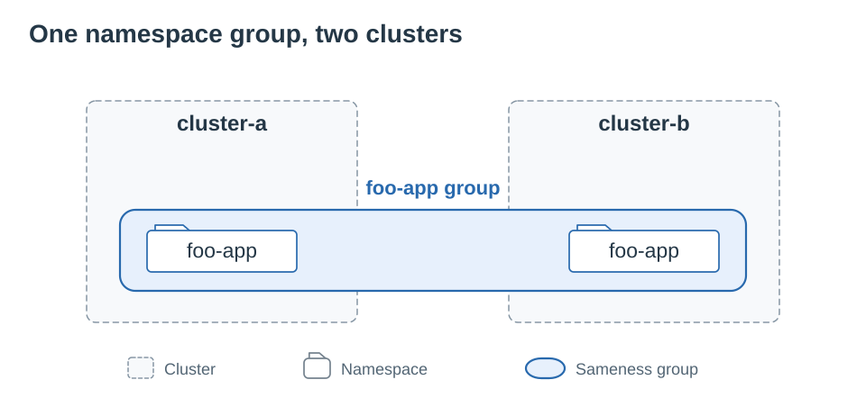
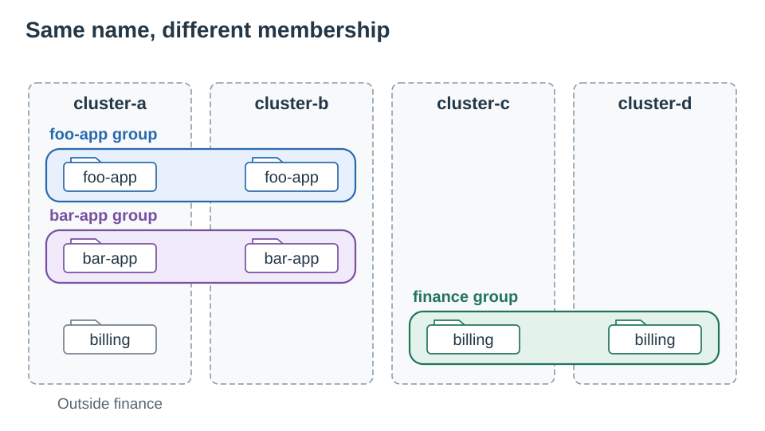
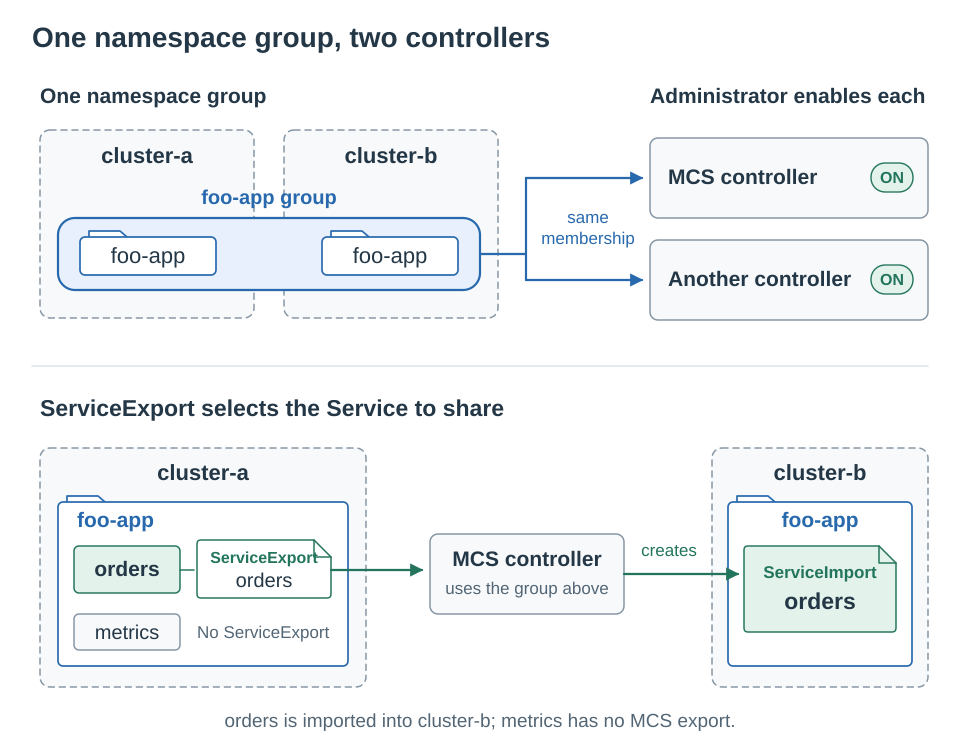
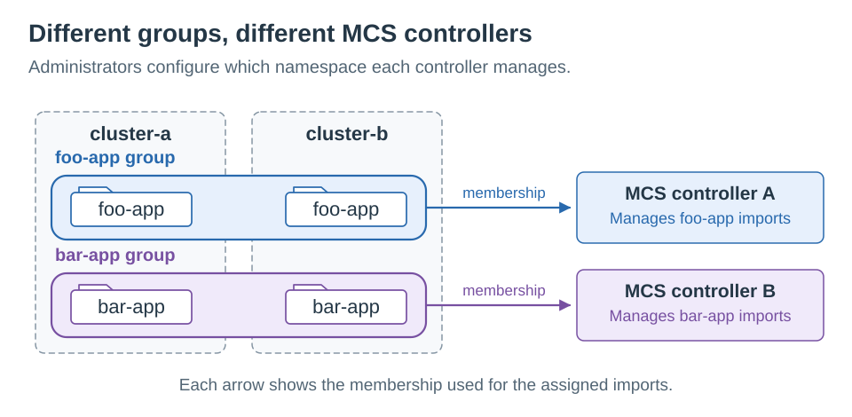
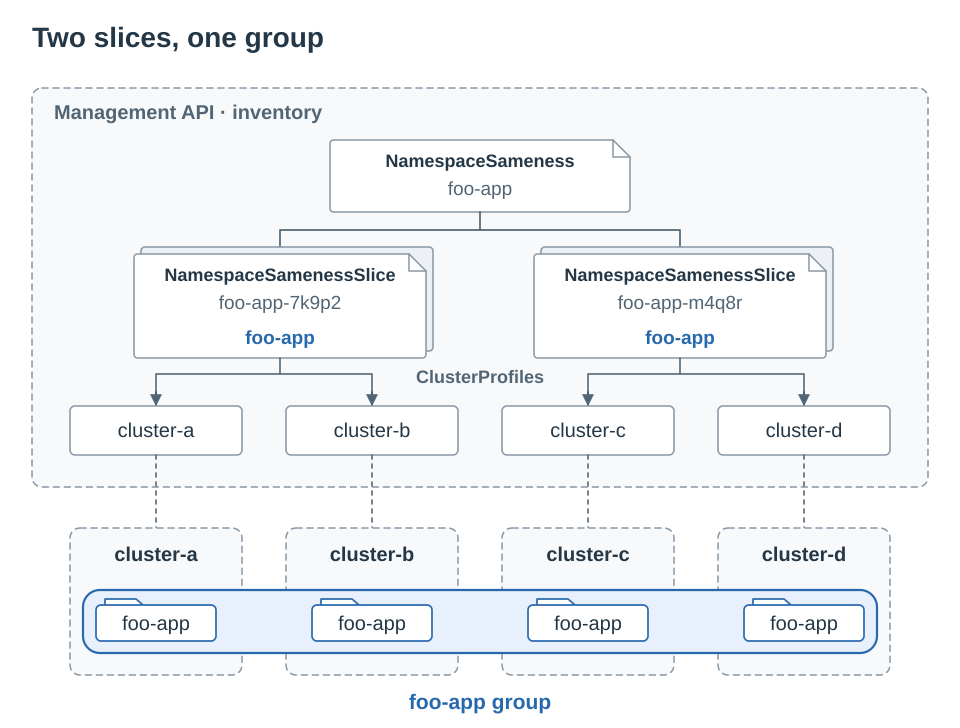
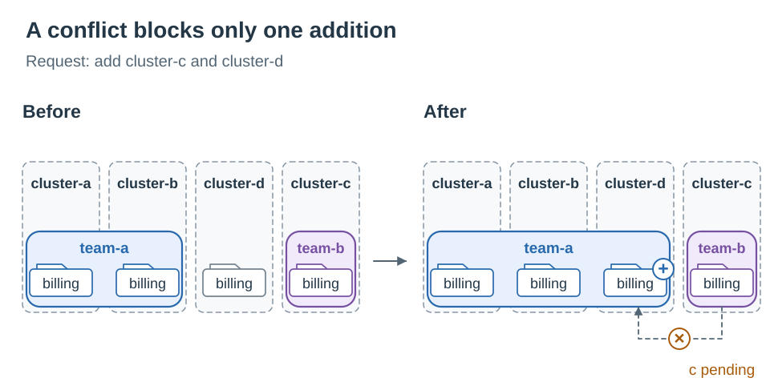
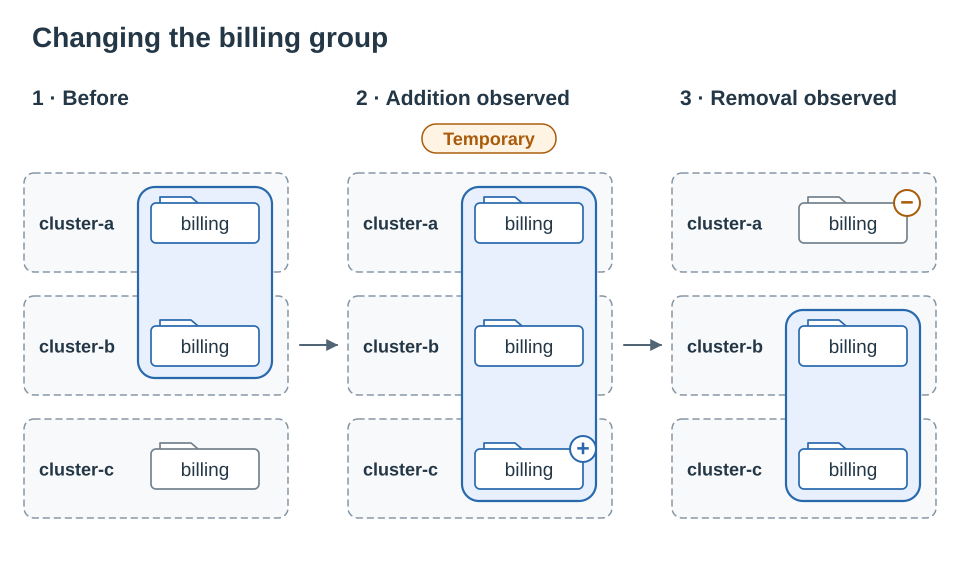

# KEP-NNNN: Namespace Sameness API

<!-- toc -->
- [Release Signoff Checklist](#release-signoff-checklist)
- [Summary](#summary)
- [Motivation](#motivation)
  - [Goals](#goals)
  - [Non-Goals](#non-goals)
- [Proposal](#proposal)
  - [User Stories](#user-stories)
    - [Namespace Boundaries for Application Teams](#namespace-boundaries-for-application-teams)
    - [Adding Members Without Disrupting Existing Relationships](#adding-members-without-disrupting-existing-relationships)
    - [Publishing a Large Group](#publishing-a-large-group)
  - [Notes/Constraints/Caveats](#notesconstraintscaveats)
  - [Risks and Mitigations](#risks-and-mitigations)
- [Design Details](#design-details)
  - [Terminology](#terminology)
  - [API Definition](#api-definition)
    - [NamespaceSameness](#namespacesameness)
    - [Cluster Selection](#cluster-selection)
    - [NamespaceSamenessSlice](#namespacesamenessslice)
    - [API Examples](#api-examples)
  - [Cluster Identity](#cluster-identity)
  - [Namespace Sameness](#namespace-sameness)
    - [Overlapping Groups](#overlapping-groups)
  - [Validation](#validation)
  - [Membership Reconciliation](#membership-reconciliation)
    - [Accepting Clusters](#accepting-clusters)
    - [Status Conditions](#status-conditions)
    - [Incremental Updates](#incremental-updates)
    - [Deletion and Cleanup](#deletion-and-cleanup)
    - [Consumer Processing](#consumer-processing)
    - [Read Failures and Recovery](#read-failures-and-recovery)
  - [Ownership and Security](#ownership-and-security)
  - [Relationship to Other APIs](#relationship-to-other-apis)
  - [Test Plan](#test-plan)
      - [Prerequisite testing updates](#prerequisite-testing-updates)
      - [Unit tests](#unit-tests)
      - [Integration tests](#integration-tests)
      - [e2e tests](#e2e-tests)
      - [Scalability tests](#scalability-tests)
  - [Graduation Criteria](#graduation-criteria)
    - [Alpha](#alpha)
    - [Beta](#beta)
    - [GA](#ga)
  - [Upgrade / Downgrade Strategy](#upgrade--downgrade-strategy)
  - [Version Skew Strategy](#version-skew-strategy)
- [Production Readiness Review Questionnaire](#production-readiness-review-questionnaire)
  - [Feature Enablement and Rollback](#feature-enablement-and-rollback)
  - [Rollout, Upgrade and Rollback Planning](#rollout-upgrade-and-rollback-planning)
  - [Monitoring Requirements](#monitoring-requirements)
  - [Dependencies](#dependencies)
  - [Scalability](#scalability)
  - [Troubleshooting](#troubleshooting)
- [Implementation History](#implementation-history)
- [Drawbacks](#drawbacks)
- [Alternatives](#alternatives)
  - [Infer Sameness from ClusterSet Membership](#infer-sameness-from-clusterset-membership)
  - [Resolve Selectors in Every Consumer](#resolve-selectors-in-every-consumer)
  - [Store All Cluster References on the Parent](#store-all-cluster-references-on-the-parent)
  - [Publish Only Slices](#publish-only-slices)
  - [Reference PlacementDecision Directly](#reference-placementdecision-directly)
  - [Publish Atomic Membership Snapshots](#publish-atomic-membership-snapshots)
- [Infrastructure Needed](#infrastructure-needed)
<!-- /toc -->

## Release Signoff Checklist

The standard checklist below applies to enhancements targeting a core Kubernetes
release. This proposal defines an out-of-tree API. Its release process,
documentation location, and conformance requirements will be agreed with
SIG Multicluster before the KEP becomes implementable.

Items marked with (R) are required *prior to targeting to a milestone / release*.

- [ ] (R) Enhancement issue in release milestone, which links to KEP dir in [kubernetes/enhancements] (not the initial KEP PR)
- [ ] (R) KEP approvers have approved the KEP status as `implementable`
- [ ] (R) Design details are appropriately documented
- [ ] (R) Test plan is in place, giving consideration to SIG Architecture and SIG Testing input (including test refactors)
  - [ ] e2e Tests for all Beta API Operations (endpoints)
  - [ ] (R) Ensure GA e2e tests meet requirements for [Conformance Tests](https://github.com/kubernetes/community/blob/master/contributors/devel/sig-architecture/conformance-tests.md)
  - [ ] (R) Minimum Two Week Window for GA e2e tests to prove flake free
- [ ] (R) Graduation criteria is in place
  - [ ] (R) [all GA Endpoints](https://github.com/kubernetes/community/pull/1806) must be hit by [Conformance Tests](https://github.com/kubernetes/community/blob/master/contributors/devel/sig-architecture/conformance-tests.md) within one minor version of promotion to GA
- [ ] (R) Production readiness review completed
- [ ] (R) Production readiness review approved
- [ ] "Implementation History" section is up-to-date for milestone
- [ ] User-facing documentation has been created in [kubernetes/website], for publication to [kubernetes.io]
- [ ] Supporting documentation—e.g., additional design documents, links to mailing list discussions/SIG meetings, relevant PRs/issues, release notes

## Summary

This KEP proposes a Kubernetes API for expressing which same-named
namespaces in different clusters are treated as the same namespace.
Administrators create a `NamespaceSameness` for a namespace name and select
clusters. A producer publishes the namespace name and participating
ClusterProfiles in `NamespaceSamenessSlice` resources associated with that
parent.

Multicluster controllers read slices and the referenced ClusterProfiles when
deciding whether to combine resources across clusters, such as endpoints for
a multi-cluster Service. They reconcile their applied relationships with the
published membership without reading `NamespaceSameness` or evaluating
selection policy. Slices bound the size of individual objects and allow
membership changes without rewriting an entire large group.

For example, `foo-app` in `cluster-a` and `cluster-b` belongs to one namespace
sameness group. The band below encloses the participating namespaces across
the two cluster boundaries.



A [Multi-Cluster Services API (MCS)][KEP-1645] controller must explicitly
integrate this API to use that relationship when combining Service exports.
[Notes/Constraints/Caveats](#notesconstraintscaveats) describes how administrators
configure integrations to use the published membership.

## Motivation

The [Namespace Sameness position statement] treats same-named namespaces in a
related set of clusters governed by a single authority as the same namespace,
with a consistent owner across that set. The [Multi-Cluster Services API][KEP-1645]
uses this assumption within a ClusterSet to combine exports with the same
Service and namespace names.

This proposal extends that model by allowing an administrator to declare the
related cluster set separately for each namespace name. Consumers use these
declarations through the explicit integration described in
[Notes/Constraints/Caveats](#notesconstraintscaveats).

An organization may need different sets of clusters for different namespaces.
For example, application teams may use `foo-app` and `bar-app` in
`cluster-a` and `cluster-b`, while the finance team uses `billing` in
`cluster-c` and `cluster-d`. Creating a namespace named `billing` in
`cluster-a` should not make it part of the finance team's namespace.



An administrator can select clusters using inventory labels or properties.
A provider may instead already maintain these boundaries in configuration or a
database. In either case, a service mesh or another multicluster controller
needs the resulting membership to interpret resources consistently with the
provider. Requiring every consumer to evaluate the provider's policy makes
integration specific to each deployment.

This proposal provides a Kubernetes API for both a selection request and its
accepted membership. A deployment can also publish membership from an external
policy system. Consumers use the same interface in either case.

### Goals

- Publish explicit namespace sameness relationships that multicluster
  controllers can consume through a common Kubernetes API.
- Support ClusterProfile selection by labels and properties while keeping
  consumer processing independent of selection policy.
- Permit cluster membership changes without interrupting existing
  relationships when an additional member conflicts.
- Define consumer handling of overlapping relationships, incremental updates,
  and deletion.
- Design for groups containing 100,000 clusters using bounded API objects, and
  validate this target before claiming a supported scale limit.

### Non-Goals

- Create namespaces, select Namespace objects by label, assign their owners,
  or distribute namespace RBAC.
- Define a general placement API, scheduling priorities, or workload placement.
- Define Service export policy, workload authentication, network authorization,
  or connectivity.
- Provide atomic updates across slices or simultaneous application by consumers.
- Change existing MCS or ClusterSet behavior without explicit consumer
  integration.
- Define API endpoint discovery, replication between API servers, or a
  non-Kubernetes consumer interface.

## Proposal

An administrator creates a `NamespaceSameness` with a namespace name and,
optionally, selectors over ClusterProfiles. A producer evaluates the request,
checks for conflicting membership, and publishes the result.

| Resource or field | Writer | Purpose |
| --- | --- | --- |
| `NamespaceSameness.spec.namespace` | Fleet administrator or authorized policy system | Specify the namespace name; immutable after creation |
| `NamespaceSameness.spec.clusterSelectors` | Fleet administrator or authorized policy system | Select candidate ClusterProfiles |
| `NamespaceSameness.status` | Assigned producer | Report cluster reconciliation conditions |
| `NamespaceSamenessSlice.namespace` | Assigned producer | Publish the target Namespace name; immutable after creation |
| `NamespaceSamenessSlice.clusters` | Assigned producer | Publish participating ClusterProfile references in bounded objects |

A consumer lists and watches slices and referenced inventory, validates
references, and resolves member identities as specified in
[Cluster Identity](#cluster-identity).
It derives each group's namespace name and membership from its slices, checks
for overlapping relationships, and reconciles its applied state with the
result. [Consumer Processing](#consumer-processing) defines these checks.

### User Stories

#### Namespace Boundaries for Application Teams

A fleet administrator defines the following groups:

| NamespaceSameness | Namespace name | Member clusters |
| --- | --- | --- |
| `foo-app` | `foo-app` | `cluster-a`, `cluster-b` |
| `bar-app` | `bar-app` | `cluster-a`, `cluster-b` |
| `finance` | `billing` | `cluster-c`, `cluster-d` |

An MCS implementation that integrates this API can combine exports for
`foo-app/orders` from `cluster-a` and `cluster-b`, subject to its existing
Service export and compatibility rules. It does not combine an export for
`billing/payments` from `cluster-a` with exports from the finance clusters.

Suppose an attacker compromises `cluster-a` and creates the `billing`
namespace, a `payments` Service, and a `payments` ServiceExport. The attacker's
credentials cannot change the authoritative sameness resources or the
inventory data used for selection. The MCS implementation authenticates the
export's source as `cluster-a`, which is not a finance member. The new export
therefore does not join the finance Service. The trust requirements are
specified in [Ownership and Security](#ownership-and-security).

#### Adding Members Without Disrupting Existing Relationships

The `team-a` group already includes `billing` in `cluster-a` and `cluster-b`.
An administrator changes its selection to also include `cluster-c` and
`cluster-d`. The `team-b` group already includes `billing` in `cluster-c`.

The producer retains `cluster-a` and `cluster-b`, adds `cluster-d`, and
leaves `cluster-c` out of the slices. A condition reports the pending
addition. Resolving the conflict allows the producer to add `cluster-c`
without resubmitting the request.

#### Publishing a Large Group

An administrator wants `catalog` to have namespace sameness across 100,000
clusters. With one ClusterProfile per member, the producer can represent the
membership with one parent and 1,000 slices of 100 references each. Each
slice carries `namespace: catalog`.

When one cluster leaves, the producer updates the slice containing it.
Unchanged slices need not be rewritten or repacked. Consumers observe the
individual updates and use the membership currently published, including
during initial population. This API does not wait for a complete group-wide
snapshot before exposing membership.

### Notes/Constraints/Caveats

This API requires a producer and an explicitly configured consumer. Installing
the CRDs alone does not change namespace or MCS behavior. The administrator
configures which multicluster controllers use the published membership.
Multiple controllers can use the same membership.



Namespace membership, the choice of implementation, and Service publication
are configured separately:

| Decision | Example | Determined by |
| --- | --- | --- |
| Which clusters treat a namespace name as the same namespace? | `foo-app` in `cluster-a` and `cluster-b` | Published NamespaceSamenessSlice membership |
| Which implementation manages resources? | An MCS controller manages imports for `foo-app/orders` | Administrator configuration for the implementation |
| Which Services are exported? | Publish `foo-app/orders` to other clusters | MCS ServiceExport resources and Service export policy |

For example, when `cluster-a` and `cluster-b` belong to the `foo-app` group,
an integrating MCS controller can combine their exports for `foo-app/orders`,
subject to ServiceExport and Service compatibility rules. Publishing this
membership does not create ServiceExports or select the controller that
manages the corresponding ServiceImports. An MCS integration must apply the
relationship to both the authenticated sources of exports and the destination
namespace before combining or importing resources. This KEP does not change
ServiceImport naming or the MCS specification.

When multiple integrations run in a deployment, administrators configure which
resources each integration manages and how they cooperate on shared resources,
such as ServiceImports and EndpointSlices.

For example, an administrator can configure MCS controller A to manage imports
in `foo-app` and MCS controller B to manage imports in `bar-app`. Each controller
applies the membership for the namespace it manages.



Assigning different resources to controllers does not narrow their conflict
checks. Each still observes all slices in its configured authority scope, as
described in [Consumer Processing](#consumer-processing).

An administrator can also configure a separate controller to automate setup,
for example by adding implementation-specific labels to participating
Namespaces. Such automation uses the published membership together with
separate configuration for enabling the integration.

A producer can obtain candidate clusters from selectors or from an external
source, such as a PlacementDecision, SQL database, or static configuration.
For external selection, the parent omits `spec.clusterSelectors`; the
assigned producer still manages acceptance, status, and slices. The external
schema and access protocol are internal to that producer.

Deployments may host the API on a management cluster or on regional API servers.
The administrator configures each consumer's trusted API endpoint and resource
namespace. When projecting groups to another API server, the producer must
resolve ClusterProfile references and parent ownership on that server.
Consumers do not combine resources from independent endpoints into one group.

### Risks and Mitigations

An incorrect membership decision can combine resources belonging to different
teams. Producer checks prevent conflicting additions in normal operation.
Consumers independently detect published conflicts because checks by different
producers can race. Neither status nor a successful API write reserves
membership against another writer.

Slice updates are incremental. An intermediate cluster set can differ from
both the previous and the desired set, and can establish a relationship absent
from either. [Incremental Updates](#incremental-updates) describes this
limitation with an example. Integrations requiring atomic boundary changes
need additional coordination outside this API.

Inventory identity and selection inputs are security-sensitive. A writer able
to change a ClusterProfile's member ID, labels, or properties may alter
membership or its interpretation. [Ownership and Security](#ownership-and-security)
defines the required trust in inventory writers and authenticated cluster identity.

Retaining applied membership during an API outage preserves existing behavior
but delays revocation. This proposal defines neither a lease nor an expiry
time. A consumer without an initial synchronized view asserts no cross-cluster
sameness.

API and security review should include SIG Multicluster and SIG API Machinery,
with SIG Auth input on writer permissions and inventory authorization. Consumer
integrations need review of their resource aggregation and removal behavior.

## Design Details

### Terminology

- **Authority scope**: A configured Kubernetes API endpoint and resource
  namespace whose groups a consumer trusts. Conflict detection covers every
  group in this scope.
- **Group**: The namespace name and members published by slices with the same
  controller owner UID within an authority scope. This UID identifies the
  `NamespaceSameness` request for which the producer created the slices.
- **Producer**: The controller assigned to reconcile a parent's request and
  publish its status and slices, including when policy comes from outside
  Kubernetes.
- **Consumer**: A multicluster controller that uses published membership to
  interpret resources across clusters.

### API Definition

The proposed API group and version is `multicluster.x-k8s.io/v1alpha1`.
Both `NamespaceSameness` and `NamespaceSamenessSlice` are namespace-scoped.
`NamespaceSameness` exposes a status subresource; slices contain data fields
without `spec` or `status`.

On both kinds, `metadata.namespace` determines where the object is stored and
authorized. The parent's `spec.namespace` and the slice's top-level `namespace`
identify the Namespace name in member clusters. For example, resources stored
in `inventory` can describe `foo-app` in other clusters; they do not describe
the management cluster's `inventory` namespace.

#### NamespaceSameness

```go
// NamespaceSameness requests cluster membership for one Namespace name.
// +kubebuilder:object:root=true
// +kubebuilder:resource:scope=Namespaced
// +kubebuilder:subresource:status
type NamespaceSameness struct {
    metav1.TypeMeta   `json:",inline"`
    metav1.ObjectMeta `json:"metadata,omitempty"`

    Spec NamespaceSamenessSpec `json:"spec"`

    // +optional
    Status NamespaceSamenessStatus `json:"status,omitempty"`
}

type NamespaceSamenessSpec struct {
    // Namespace is the exact Kubernetes Namespace name in member clusters.
    // This field is immutable.
    // +required
    // +kubebuilder:validation:MinLength=1
    // +kubebuilder:validation:MaxLength=63
    // +kubebuilder:validation:Pattern=`^[a-z0-9]([-a-z0-9]*[a-z0-9])?$`
    // +kubebuilder:validation:XValidation:rule="self == oldSelf",message="namespace is immutable"
    Namespace string `json:"namespace"`

    // ClusterSelectors selects candidate ClusterProfiles in this object's
    // metadata.namespace. A profile must match at least one entry.
    // An empty entry selects every profile in that namespace.
    // Omitted or empty lists leave selection to an external producer.
    // +optional
    // +listType=atomic
    ClusterSelectors []ClusterSelector `json:"clusterSelectors,omitempty"`
}

type ClusterSelector struct {
    // LabelSelector matches ClusterProfile metadata.labels.
    // Omitted or empty selectors impose no label constraint.
    // +optional
    LabelSelector *metav1.LabelSelector `json:"labelSelector,omitempty"`

    // PropertySelector matches ClusterProfile status.properties.
    // Omitted or empty selectors impose no property constraint.
    // +optional
    PropertySelector *PropertySelector `json:"propertySelector,omitempty"`
}

type PropertySelector struct {
    // MatchProperties requires each named property to have the given value.
    // These requirements and MatchExpressions must all match.
    // +optional
    MatchProperties map[string]string `json:"matchProperties,omitempty"`

    // MatchExpressions contains property requirements that must all match.
    // +optional
    // +listType=atomic
    MatchExpressions []PropertySelectorRequirement `json:"matchExpressions,omitempty"`
}

type PropertySelectorRequirement struct {
    // Key is a property name, not a metadata label key.
    // +kubebuilder:validation:MinLength=1
    // +kubebuilder:validation:MaxLength=253
    Key string `json:"key"`

    Operator PropertySelectorOperator `json:"operator"`

    // Values must be non-empty for In and NotIn, and empty for Exists
    // and DoesNotExist.
    // +optional
    // +listType=atomic
    Values []string `json:"values,omitempty"`
}

// +kubebuilder:validation:Enum=In;NotIn;Exists;DoesNotExist
type PropertySelectorOperator string

const (
    PropertySelectorOpIn           PropertySelectorOperator = "In"
    PropertySelectorOpNotIn        PropertySelectorOperator = "NotIn"
    PropertySelectorOpExists       PropertySelectorOperator = "Exists"
    PropertySelectorOpDoesNotExist PropertySelectorOperator = "DoesNotExist"
)

type NamespaceSamenessStatus struct {
    // Conditions reports cluster reconciliation.
    // It is not an acknowledgement from consumers.
    // +optional
    // +listType=map
    // +listMapKey=type
    Conditions []metav1.Condition `json:"conditions,omitempty"`
}
```

`spec.namespace` is required, must satisfy Kubernetes Namespace name
validation, and cannot be changed after creation. To manage another namespace
name, the administrator creates another parent. `spec.clusterSelectors` is
mutable. Cluster membership changes as the producer updates the slices.

#### Cluster Selection

A ClusterProfile is selected if it matches any entry in
`spec.clusterSelectors`. Within an entry, all specified selectors must match.
Each selector's map entries and expression requirements must also all match.
Reordering entries does not change the selected set.

| Selector field | ClusterProfile data | Map field | Expression field |
| --- | --- | --- | --- |
| `labelSelector` | `metadata.labels` | `matchLabels` | `matchExpressions` |
| `propertySelector` | `status.properties`, indexed by property name | `matchProperties` | `matchExpressions` |

`labelSelector` uses the standard [LabelSelector] type and validation.
`propertySelector` compares the inventory's property names and string values.
A `matchProperties` entry is equivalent to an `In` expression containing
one value. Property names have 1 through 253 characters and values have 1
through 1,024 characters, following the [ClusterProfile property definition].
Label key and value syntax restrictions do not apply to properties.

Both expression fields use `key`, `operator`, and optional `values`:

| Operator | Match requirement | `values` requirement | If the key is absent |
| --- | --- | --- | --- |
| `In` | Value equals any listed value | At least one value | Does not match |
| `NotIn` | Value equals none of the listed values, or key is absent | At least one value | Matches |
| `Exists` | Key is present | Empty or omitted | Does not match |
| `DoesNotExist` | Key is absent | Empty or omitted | Matches |

There is no numeric comparison or interpretation of special strings in
property values. Selection uses the properties currently recorded in the
ClusterProfile, without querying member clusters or applying an implicit
property-age or health filter. Missing inventory observations due to a failed
read are not evidence that a key is absent.

| `spec.clusterSelectors` | Meaning |
| --- | --- |
| Omitted or `[]` | The assigned external producer supplies candidate clusters |
| `[{}]` | All ClusterProfiles in the parent's namespace |
| One or more non-empty entries | Union of the profiles matching those entries |

An omitted, null, or empty nested `labelSelector` or `propertySelector`
imposes no constraint of that kind. An empty entry therefore selects all
profiles in scope. A non-empty selector that matches no profiles produces an
empty candidate set; it does not fall back to external selection or all
profiles.

Selection is limited to the parent's API server and namespace, regardless of
the producer's broader read permissions. The producer observes profile
creation, deletion, and changes to selected labels or properties. A matching
profile is a candidate, not an accepted member, until it passes the checks in
[Membership Reconciliation](#membership-reconciliation).

#### NamespaceSamenessSlice

```go
// NamespaceSamenessSlice publishes a Namespace name and part of a group's
// participating cluster set. Cluster references can be updated independently
// of other slices.
// +kubebuilder:object:root=true
// +kubebuilder:resource:scope=Namespaced
type NamespaceSamenessSlice struct {
    metav1.TypeMeta   `json:",inline"`
    metav1.ObjectMeta `json:"metadata,omitempty"`

    // Namespace is the exact Kubernetes Namespace name in member clusters.
    // The producer sets it to the parent's spec.namespace.
    // This field is immutable.
    // +required
    // +kubebuilder:validation:MinLength=1
    // +kubebuilder:validation:MaxLength=63
    // +kubebuilder:validation:Pattern=`^[a-z0-9]([-a-z0-9]*[a-z0-9])?$`
    // +kubebuilder:validation:XValidation:rule="self == oldSelf",message="namespace is immutable"
    Namespace string `json:"namespace"`

    // Clusters contains up to 100 ClusterProfile references.
    // +kubebuilder:validation:MaxItems=100
    // +listType=atomic
    Clusters []NamespaceSamenessCluster `json:"clusters"`

    // ProducerName identifies the component for diagnostics only.
    // +optional
    ProducerName string `json:"producerName,omitempty"`
}

type NamespaceSamenessCluster struct {
    // ClusterProfileRef requires APIVersion, Kind, Namespace, Name, and UID.
    ClusterProfileRef corev1.ObjectReference `json:"clusterProfileRef"`
}

const NamespaceSamenessNameLabel =
    "multicluster.x-k8s.io/namespace-sameness-name"
```

The producer sets the slice's required `namespace` field to the parent's
`spec.namespace`. It uses the same Namespace name validation and is immutable.
Consumers read this field directly; they do not fetch the parent to obtain a
namespace name or check its existence, spec, or status.

A slice must be stored in the same namespace as its parent, carry the parent's
name in `NamespaceSamenessNameLabel`, and have a controller owner reference
to that `NamespaceSameness`, including its UID. Parent names must be valid
DNS subdomains no longer than 63 characters so they fit in the label value.
Consumers check that the controller owner reference has the expected API group
and kind, a non-empty name and UID, and a name matching the parent-name label.
The owner UID identifies the group within the authority scope; a matching label
alone does not combine slices into a group. The owner's API version is a served
representation, not part of the group identity.

All slices in a group must carry the same `namespace`. If they disagree, the
consumer excludes the whole group rather than choosing a value or treating it
as multiple groups. Diagnostics identify the inconsistent slices and values.

Producers SHOULD NOT change a slice's parent association. They should create
a new slice when publishing membership for another parent. Labels and owner
references are not inherently immutable, and this recommendation does not
require a validating webhook. A consumer checks association on every observed
update and removes membership from the previous association if it changes.

Each cluster reference identifies a `ClusterProfile` in the
`multicluster.x-k8s.io` API group on the API server serving the slice.
Selector-driven producers publish references in the parent's namespace. An
external producer may use references in other namespaces on that server if
both producer and consumer are authorized to read them. Reference validation
and the identity of the represented member follow
[Cluster Identity](#cluster-identity).

#### API Examples

The examples include foreground garbage collection settings.
[Deletion and Cleanup](#deletion-and-cleanup) explains these settings and
shows how to delete a parent and its slices.

The administrator submits the following parent. Labels such as
`example.com/team` are illustrative inventory labels; the region and zone
properties must be populated by the inventory.

```yaml
apiVersion: multicluster.x-k8s.io/v1alpha1
kind: NamespaceSameness
metadata:
  name: foo-app
  namespace: inventory
  finalizers:
  - foregroundDeletion
spec:
  namespace: foo-app
  clusterSelectors:
  - labelSelector:
      matchLabels:
        example.com/team: applications
      matchExpressions:
      - key: example.com/environment
        operator: In
        values:
        - production
        - staging
    propertySelector:
      matchProperties:
        region.topology.k8s.io: ap-northeast-1
      matchExpressions:
      - key: zone.topology.k8s.io
        operator: In
        values:
        - ap-northeast-1a
        - ap-northeast-1c
  - labelSelector:
      matchLabels:
        example.com/team: platform
```

The first entry selects application clusters in either listed environment,
in the specified region and either listed zone. The second entry also selects
platform clusters without imposing an environment, region, or zone condition.

Suppose the matching, non-conflicting profiles are `cluster-a` and
`cluster-b`. The API server assigns the parent a UID, and the producer
writes its status through the status subresource. The following is an excerpt
from the observed parent, not additional fields for the input manifest:

```yaml
metadata:
  name: foo-app
  namespace: inventory
  uid: 11111111-1111-1111-1111-111111111111
  generation: 1
  finalizers:
  - foregroundDeletion
status:
  conditions:
  - type: ClustersResolved
    status: "True"
    observedGeneration: 1
    lastTransitionTime: "2026-09-05T00:00:00Z"
    reason: Resolved
    message: All selected clusters are published.
```

The producer creates this child. The example ClusterProfiles are served at
`v1alpha2` and must exist with the recorded UIDs. Their
`multicluster.x-k8s.io/inventory-member-id` values are `cluster-a` and
`cluster-b`, respectively.

```yaml
apiVersion: multicluster.x-k8s.io/v1alpha1
kind: NamespaceSamenessSlice
metadata:
  name: foo-app-7k9p2
  namespace: inventory
  labels:
    multicluster.x-k8s.io/namespace-sameness-name: foo-app
  ownerReferences:
  - apiVersion: multicluster.x-k8s.io/v1alpha1
    kind: NamespaceSameness
    name: foo-app
    uid: 11111111-1111-1111-1111-111111111111
    controller: true
    blockOwnerDeletion: true
namespace: foo-app
clusters:
- clusterProfileRef:
    apiVersion: multicluster.x-k8s.io/v1alpha2
    kind: ClusterProfile
    namespace: inventory
    name: cluster-a
    uid: aaaaaaaa-aaaa-aaaa-aaaa-aaaaaaaaaaaa
- clusterProfileRef:
    apiVersion: multicluster.x-k8s.io/v1alpha2
    kind: ClusterProfile
    namespace: inventory
    name: cluster-b
    uid: bbbbbbbb-bbbb-bbbb-bbbb-bbbbbbbbbbbb
producerName: example.com/namespace-sameness-resolver
```

Additional slices use the same namespace name, label, and owner UID. Object
names do not encode ordering or membership. The next example extends the
two-member manifest above to four members across two slices. Each ClusterProfile
has a distinct inventory member ID, so the consumer derives one `foo-app` group
covering all four clusters. Splitting references across slices does not split
the namespace sameness group.



To request all ClusterProfiles in `inventory`, the administrator can submit:

```yaml
apiVersion: multicluster.x-k8s.io/v1alpha1
kind: NamespaceSameness
metadata:
  name: fleet-observability
  namespace: inventory
  finalizers:
  - foregroundDeletion
spec:
  namespace: observability
  clusterSelectors:
  - {}
```

To use an assigned producer backed by an external policy system, the
administrator omits selectors:

```yaml
apiVersion: multicluster.x-k8s.io/v1alpha1
kind: NamespaceSameness
metadata:
  name: finance
  namespace: inventory
  finalizers:
  - foregroundDeletion
spec:
  namespace: billing
```

This last manifest does not publish membership by itself. The assigned
producer must check candidate clusters for conflicts and publish accepted
profiles in slices.
Installing a selector-based controller must not cause it to take ownership
of parents configured for an external producer.

### Cluster Identity

Producers and consumers use ClusterProfile references to locate inventory
objects and determine which member clusters they represent. They first
validate each reference against the object on the API server serving the
slice, including its API group, kind, namespace, name, and UID. The API version
is a served representation of that object, not another identity.

A missing object or UID mismatch invalidates the reference. Another
ClusterProfile with the same member ID does not replace it. The producer
must publish a valid reference before that object can contribute membership.

For a valid reference, member identity follows the
[ClusterProfile member identity convention]. Producers use the same rules
when checking selected candidate profiles:

| Referenced ClusterProfile's `multicluster.x-k8s.io/inventory-member-id` | Member identity |
| --- | --- |
| Non-empty | The API server and label value |
| Missing or empty | The API server and the ClusterProfile's namespace, name, and UID |

These are distinct identity forms; a member ID value is not compared to an
object UID. Equal non-empty values on the same API server identify one member,
including when the profiles reside in different inventory namespaces.
Different API servers do not share this identity space. Missing or empty
labels do not prevent participation, but different unlabeled profiles are not
correlated even if they represent the same physical cluster.

Within each group, all valid references with the same member identity count
as one member. Two profiles for one member establish no cross-cluster
relationship by themselves. Comparison covers only the profiles referenced
by groups in the configured authority scope and, for a producer, its selected
candidates. An equal ID does not make an unselected profile eligible, add an
unreferenced profile to a group, or combine independent authority scopes.

The label is read from the referenced ClusterProfile, not copied into the
slice. Producers and consumers recompute member identities and conflicts when
they observe the label being added, changed, removed, or set to an empty value,
even if selectors and slice references have not changed. They must not treat
a failed inventory read as a missing label; read-failure handling follows
[Read Failures and Recovery](#read-failures-and-recovery).

### Namespace Sameness

The namespace named by the slices' `namespace` field has namespace sameness
across the group's published cluster set. Different namespace names never
become the same through this API. Two groups may describe the same name in
disjoint sets of clusters.

A namespace need not exist when membership is published. If it is created
later, the relationship applies to it. Deleting and recreating a namespace
with the same name does not change the relationship: membership uses the
namespace name, not the Namespace object UID.

A consumer asserts sameness only when the common namespace name and both
member identities occur in one eligible group from a configured authority
scope. It must not infer membership from matching names, member-cluster
resources, or groups in independent authority scopes. A group with zero or
one participating cluster establishes no cross-cluster relationship.

#### Overlapping Groups

Within an authority scope, a pair of member identity and namespace name must
not belong to more than one group. Conflict checks resolve all valid published
references using [Cluster Identity](#cluster-identity) and combine the result
with the namespace name published in each slice. The check covers published
claims before excluding any group, including one whose slices disagree on
the namespace name. Unpublished candidates do not establish membership. An
empty cluster set does not reserve a namespace name across the fleet.

Producers preserve established membership and withhold conflicting additions
as specified below. Independent checks can nevertheless race, and consumers
must handle conflicting published data. For example, if `team-a` contains
`billing` in A/B and `team-b` contains `billing` in B/C, both publish
`cluster-b/billing`.

The consumer excludes both groups, not just the duplicated cluster. It does
not derive A-to-C sameness by combining the groups. The check covers all
published groups before excluding any of them, so exclusion order cannot
make a conflicting group eligible.

Different ClusterProfile references can also produce an overlap. For example,
two groups in `inventory` on one API server publish the following references.
Their slices have different owner UIDs and all specify `namespace: billing`:

| Group (owner name) | Referenced ClusterProfile | Referenced UID | Inventory member ID |
| --- | --- | --- | --- |
| `finance` | `inventory/manager-a-prod` | `aaaaaaaa-aaaa-aaaa-aaaa-aaaaaaaaaaaa` | `prod` |
| `payments` | `inventory/manager-b-prod` | `bbbbbbbb-bbbb-bbbb-bbbb-bbbbbbbbbbbb` | `prod` |

Both references identify the member `prod`, so the consumer excludes both
groups for publishing `prod/billing`. The groups still conflict if one
profile is older than the other or their creation timestamps are equal.

Conflict detection must include every group's published member claims before
choosing a representative ClusterProfile for an operation. Choosing which
profile to act on follows the [ClusterProfile member identity convention];
it does not remove either group's claim from this check.

Consumer observations provide no global order in which competing additions
were accepted. A consumer therefore must not choose a winner based on watch
arrival order, parent or profile creation timestamps, a condition timestamp,
or its cached previous membership.
Producer reconciliation must resolve the published overlap; status alone is
not a reservation or a distributed lock.

### Validation

The CRD schemas validate required fields, the namespace name and its
immutability on both kinds, parent name length, selector syntax, expression
operators and value cardinality, and the 100-reference per-slice limit.
Property map keys and expression keys use the property name limits; all
property values use the property value limits. Invalid requirements are
rejected, not treated as empty selectors.

A slice requires the parent-name label, a controller owner reference to a
`NamespaceSameness` in the API group, and complete ClusterProfile references.
Parent metadata name constraints can be schema-validated. Implementations must
not assume that CRD schema validation can enforce arbitrary metadata labels
and owner references. Producers write the required association and consumers
check it when reading. Deployments may add admission policies or webhooks for
these metadata and authorization checks.

The producer ensures that a slice's namespace name and owner reference match
its assigned parent. Schema validation cannot compare these separate objects.
Consumers validate group metadata from the slices as specified in
[NamespaceSamenessSlice](#namespacesamenessslice).

ClusterProfile reference existence, UID matching, member identity resolution,
selector evaluation, and cross-group conflicts require checks against observed
resources. The producer must have read access to the inventory it publishes.
The consumer validates references independently, including after inventory
changes. A successful write does not guarantee that a reference will remain
valid.

Cluster selectors and slice membership are mutable. Status is written through
its subresource. Only the assigned producer can write status and slices.
The cross-resource ownership and authorization requirements are described in
[Ownership and Security](#ownership-and-security).

### Membership Reconciliation

#### Accepting Clusters

The producer obtains a synchronized view of parents, slices, and inventory
before accepting additions. It preserves accepted membership that is still
requested, valid, and non-conflicting. It processes removals independently of
pending additions and retries pending work when requests, inventory, or other
groups change.

A candidate profile is added to a slice only if the pair of its resolved
member identity and the parent's `spec.namespace` does not belong to another
group in the authority scope. Checks use the namespace names and references
published in other groups' slices, including references to other profiles
representing the same member. A group's published claims remain part of this
check even when its parent is deleting or absent. A conflicting candidate
remains unpublished; existing non-conflicting members remain in the slices.
The producer rechecks additions after changes to its observed view rather than
relying on an earlier condition.

For example, `team-a` publishes `billing` membership in `cluster-a` and
`cluster-b`. Its selection expands to `cluster-c` and `cluster-d`, while
`team-b` already includes `billing` in `cluster-c`:



The producer removes references to profiles no longer selected by the request.
A member leaves the published set once no valid reference to it remains in
the group's slices. Withdrawing a member requires removing every reference
to every profile representing it. A conflict elsewhere must not block
removal. These updates are observed asynchronously by consumers.

Changing between selector-based and external selection requires a coordinated
handoff to the assigned producer. The handoff must prevent simultaneous
writers and reconcile existing slices against the new source. Omitting
selectors does not, by itself, clear previously published membership.

#### Status Conditions

The producer reports cluster reconciliation using the `ClustersResolved`
condition:

| Status | Reason | Meaning |
| --- | --- | --- |
| `True` | `Resolved` | Published members match the evaluated candidate member set, with no pending candidates or unselected published references |
| `False` | `MembershipConflict` | Candidate clusters are withheld because they conflict with another group |
| `False` | `Reconciling` | Membership changes are being published |
| `Unknown` | `SourceUnavailable` | The producer cannot evaluate its inventory or external policy source |

The producer must not interpret an unavailable inventory or external source
as an empty selection.

Each condition includes `observedGeneration` for the parent spec it describes.
Inventory changes can trigger reconciliation without changing that generation.
A `True` condition describes the producer's observation; it neither freezes
the inventory nor acknowledges application by consumers.

A false, unknown, or absent condition does not disable published membership.
Conditions report producer progress to operators. Consumers use published
slices even while further additions are pending, without reading conditions
or using generation equality as a group-wide publication barrier.

When `cluster-c/billing` already belongs to `team-b`, the producer reports
the pending cluster as follows:

```yaml
status:
  conditions:
  - type: ClustersResolved
    status: "False"
    observedGeneration: 3
    lastTransitionTime: "2026-09-05T01:00:00Z"
    reason: MembershipConflict
    message: cluster-c is pending because cluster-c/billing belongs to team-b.
```

Condition messages should identify representative conflicting members and
parents. Large conflict sets belong in producer diagnostics, not unbounded
lists or messages in the parent object.

#### Incremental Updates

Slice distribution follows the [EndpointSlice] model: producers SHOULD retain
existing cluster assignments and update only slices affected by membership
changes. They should not rebalance unchanged slices solely to fill them.
There is no stable cluster-to-slice mapping or meaning attached to slice order.

The producer creates, updates, and deletes slices independently. Moving a
reference may temporarily leave it in multiple slices. Consumers count members
using [Cluster Identity](#cluster-identity), including when different profile
references resolve to the same member. A group may have no slices, and an
empty `clusters` list contributes no members. Producers should remove
unnecessary empty slices.

Consumers derive members from the union of references currently observed,
not from an expected slice count. Initial publication and subsequent changes
can therefore expose partial or mixed membership. In the following independent
example, the `billing` group changes from `cluster-a`/`cluster-b` to
`cluster-b`/`cluster-c`, with no competing group. Observing an addition before
a removal exposes an intermediate three-member set:



The intermediate set relates `cluster-a` to `cluster-c`, although neither the
original nor the desired set does. Removing `cluster-a` first can instead
expose `cluster-b` alone. A consumer can also observe events from different
resource watches at different times. Status and slice writes do not form a
transaction.

A producer should process removals before additions, but this does not create
an atomic boundary change or an acknowledgement barrier across consumers.
Applications that cannot tolerate intermediate relationships must coordinate
withdrawal and downstream application separately. This API alone provides no
such acknowledgement mechanism.

#### Deletion and Cleanup

An administrator withdraws a group by deleting its `NamespaceSameness`
parent. The [API examples](#api-examples) include these settings for
foreground garbage collection:

| Object | Setting | Purpose |
| --- | --- | --- |
| Parent `NamespaceSameness` | `metadata.finalizers: [foregroundDeletion]` | Keeps the parent visible while foreground garbage collection removes its blocking slices. |
| Child `NamespaceSamenessSlice` | `metadata.ownerReferences[].blockOwnerDeletion: true` | Makes this slice block completion of its parent's foreground deletion. |

To delete the example parent `foo-app` in `inventory`, run:

```shell
kubectl delete namespacesameness foo-app -n inventory --cascade=foreground
```

An API deletion request that omits `propagationPolicy` uses the parent's
existing finalizer to select foreground deletion. An explicit propagation
policy takes precedence over that finalizer. `kubectl delete` defaults to
`Background`, so the command specifies `--cascade=foreground` to use the
deletion order shown here. Background deletion can remove the parent before
its slices are cleaned up.

During foreground deletion, the parent has a `deletionTimestamp` and remains
visible through the API. Kubernetes garbage collection (GC) deletes the
blocking slices in its cache, then removes the parent's `foregroundDeletion`
finalizer to allow parent deletion to complete. GC does not wait for consumers
to remove the relationships they applied. See
[Kubernetes garbage collection](https://kubernetes.io/docs/concepts/architecture/garbage-collection/#foreground-cascading-deletion)
for the deletion behavior and the limits of the GC cache.

Consumers exclude a slice once they observe its `deletionTimestamp` or its
absence. Members remain published while another non-deleting slice in the
group contains a valid reference to them. When no participating members
remain, the consumer removes the relationships it applied for that group.

For example, a group has one slice publishing `foo-app` in `cluster-a` and
`cluster-b`. A foreground deletion request marks the parent for deletion
while its slice still publishes membership. The consumer continues to use
the relationship until it observes the slice's deletion, then removes the
relationship from its applied state. The diagram shows the parent still
waiting for GC to finish slice cleanup:


The producer stops publishing for a deleting or absent parent. Owner references
allow Kubernetes garbage collection to remove its slices. Cleanup is
asynchronous; a remaining non-deleting slice continues to contribute membership
under the same validation rules. Parent existence is not a consumer input.

Recreating a parent with the same name assigns it a new UID. Its new slices
form a separate group from any slices carrying the old owner UID. Both groups
participate in the usual conflict checks while their membership is published.

Deleting only a slice withdraws members for which no valid references remain
in other slices. A producer may recreate desired membership during
reconciliation. To withdraw the group permanently, delete its parent or
change the producer's desired membership, then verify removal of the published
membership and its downstream relationships.

#### Consumer Processing

For each configured authority scope, a consumer:

1. Completes a paginated list of slices, establishes its watch, and
   synchronizes the referenced inventory. These reads do not constitute a
   cross-resource snapshot.
2. Excludes deleting slices and invalid slice metadata, then groups the
   remaining slices by controller owner UID. The namespace field and metadata
   checks are specified in [NamespaceSamenessSlice](#namespacesamenessslice).
3. Validates each profile reference and resolves its member identity using
   [Cluster Identity](#cluster-identity). Repeated references to one member
   contribute one member to each group that publishes them.
4. Checks all published member/namespace pairs for overlap before excluding
   inconsistent or conflicting groups, as specified in
   [Overlapping Groups](#overlapping-groups). A group with one member
   participates even though it asserts no cross-cluster relationship.
5. Derives the relationships from the remaining groups' namespace names and
   member sets, choosing representative profiles only after conflict checks.
6. Reconciles its applied state with those relationships, including removal of
   relationships no longer present. It repeats this processing as slices,
   inventory, or its managed downstream resources change.

Consumers must observe all slices in the authority scope. Filtering to one
group could hide a conflicting group. Configuration that limits which resources
an integration manages does not narrow the scope of these conflict checks.
Independent scopes must not be unioned to infer additional sameness.

Reconciliation is idempotent: processing the same observed membership
repeatedly produces the same relationships. A slice event triggers
reconciliation of the current set; it is not a command to add or remove a
relationship independently of other slices. Once observations and downstream
writes succeed, applied relationships converge to those derived from the
published membership. A synchronized view with no slices yields no sameness
relationships from that scope.

An invalid slice association or namespace field contributes no membership.
A missing ClusterProfile or UID mismatch excludes the affected reference;
other valid references remain usable. Failure to read a reference is handled
as a read failure, not evidence of deletion. Diagnostics must identify excluded
associations, references, and namespace relationships.

Known slice deletion, slice membership removal, inventory invalidation, and
changes to resolved member identities take effect when observed. The consumer
must not restore previously applied data to bypass these changes or a detected
overlap. Conditions do not override these checks.

#### Read Failures and Recovery

Consumers follow Kubernetes [list and watch semantics][API concepts]. After a
watch expires, they rebuild the affected cache from a complete relist and
resume watching. Partial pages must not activate initial membership or be
treated as evidence of deletion.

During a read failure, an established consumer retains its last applied view
while reconnecting, subject to invalidations already observed. This retained
application state is distinct from a cache being rebuilt. A consumer without
an initial synchronized view must not assert sameness.

After a successful relist, the consumer recomputes membership from the new
view. Absent slices and profiles no longer contribute membership. Restarted
consumers reconstruct the relationships from these resources and reconcile
any previously managed downstream state; no event history is required.
Consumers can observe updates at different times, and an API outage can
delay revocation indefinitely. Neither status nor garbage collection provides
a bounded revocation time.

### Ownership and Security

The fleet administrator grants parent spec management to authorized policy
writers. For each parent, exactly one logical producer owns status and slices.
Its replicas must coordinate to avoid concurrent reconciliation. Assignment
may be configured by the deployment; this API does not select a controller
based on an untrusted diagnostic field.

| Identity | Required access | Access it must not gain merely by participating |
| --- | --- | --- |
| Policy writer | Manage assigned parent specs | Write producer status or slices |
| Producer | Read parents, slices, and inventory, update assigned status, create/update/delete assigned slices | Modify another producer's membership without an explicit assignment |
| Consumer | Get/list/watch slices and referenced inventory | Write authoritative membership |
| Member-cluster credentials | Integration-specific export access | Write sameness requests, status, slices, or trusted selection inputs |

To set `blockOwnerDeletion: true` as shown in the API examples, the producer
also needs `update` permission on `namespacesamenesses/finalizers` in the
`multicluster.x-k8s.io` API group for its assigned parents. The
`OwnerReferencesPermissionEnforcement` admission controller checks this
permission when a blocking owner reference is added or enabled.

RBAC can separate parent management, status updates, and slice operations.
It cannot alone restrict slice creation by a parent-name label. If a shared
namespace contains mutually untrusted writers, the deployment must enforce
their assignments through admission or another trusted write path, including
updates and deletion. Deployments with one trusted producer do not require a
webhook solely to enforce the parent-association recommendation.
`producerName`, labels, and owner references are not proof of writer identity.

Trusted inventory managers control ClusterProfile member IDs and the labels
and properties used in selectors. Copying member-controlled data into those
fields without authorization can grant membership or alter member identity
indirectly. Selecting every profile with `[{}]` is appropriate only when
profile registration in that namespace is governed by the intended trust policy.

The platform administrator is responsible for consistent member IDs across
profiles, following the [ClusterProfile member identity convention]. Missing
IDs can conceal duplicate representations of a cluster, while an incorrectly
shared ID can identify different clusters as one member. Changing an ID on a
referenced profile changes membership interpretation without a slice update.
Deployments may enforce non-empty or stable values through admission, but
this API does not require such admission or assume that the label is immutable.

An MCS integration must authenticate the source of exported resources and map
it to the appropriate inventory member. Neither a profile UID nor a member ID
authenticates a physical cluster. A claimed name or ID in member-supplied data
is insufficient. Projection controllers and external policy sources are also
trusted components.

The API cannot prevent a compromised cluster already authorized as a member
from supplying malicious workloads or endpoints. Service export policy,
workload identity, and network authorization remain necessary controls.

### Relationship to Other APIs

[KEP-1645] defines ServiceExport, ServiceImport, and the rules for resolving
Service conflicts. Their use with namespace membership and integration
configuration is described in
[Notes/Constraints/Caveats](#notesconstraintscaveats).

[KEP-4322] supplies ClusterProfile objects, the
[ClusterProfile member identity convention], and inventory properties. Their
use in this API is specified in [Cluster Identity](#cluster-identity).

[KEP-5313] defines PlacementDecision for publishing resolved cluster selection.
A producer can use those decisions as an external policy input and publish
accepted references in NamespaceSamenessSlices. Consumers need not resolve
PlacementDecision resources.

[Services without selectors] provide a precedent for allowing an external
producer to populate resolved membership. [EndpointSlice] provides the
incremental, bounded-object distribution model. The cluster acceptance and
cross-group conflict rules required here are specified in this KEP.

### Test Plan

This is a provisional API proposal. No implementation or runtime test results
are included in this KEP. The following tests are requirements for the API
implementation and its reference producer and consumer.

##### Prerequisite testing updates

The implementation repository will need a test API server with both CRDs and
the ClusterProfile API installed. Producer and consumer tests must control
inventory changes, list pagination, watch interruption, and event delivery
order. Authorization tests need deployments with a single trusted producer and
with enforced assignments among multiple writers. MCS tests also need an
implementation that explicitly integrates NamespaceSameness.

##### Unit tests

Test API validation, parent name length, references, owner association, and
the 100-reference per-slice boundary. On both kinds, reject missing, empty,
and invalid namespace names and attempts to replace or remove them. Allow
selector changes on the parent and reference changes on slices. The slice
limit applies before resolving duplicate member identities.

Test slice grouping by authority scope and controller owner UID, without a
parent lookup. Reject invalid metadata and exclude a group whose slices
disagree on the namespace name. Its published member/namespace pairs must
still participate in cross-group conflict checks. Test repeated reconciliation
and reconstruction from the same observed set, including an empty set, without
depending on the event sequence that produced it.

For each selector kind, test map-only, expression-only, and combined
requirements. Cover:

- AND within an entry and OR across entries, including reordered and duplicate
  entries.
- Every expression operator with present and absent keys; invalid operators,
  empty `In`/`NotIn` values, and non-empty `Exists`/`DoesNotExist` values.
- Property strings that are not valid label values, including lengths greater
  than 63 characters, without interpreting them as numbers or templates.
- Omitted and empty selector lists, empty entries, omitted/null/empty nested
  selectors, and a non-empty selector matching no profiles.
- Profiles outside the parent's namespace, even when the producer can read
  them, and changes to labels, properties, and profile registration.
- Unavailable inventory reads without treating them as missing keys or an
  empty candidate set.

Test cluster acceptance independently from consumer conflict detection.
Pending additions must not invalidate established non-conflicting membership.
Test conflict checks against groups with the same namespace name, including
groups publishing only one cluster. A cluster may participate in groups for
different namespace names. Test that reference union is idempotent and
independent of slice order, and that duplicate references do not create
additional members. Cover the following identity cases:

- Different names or UIDs with the same non-empty member ID on one API server,
  including profiles in different inventory namespaces.
- Equal member IDs on different API servers, and equal IDs referenced from
  independent authority scopes without combining their groups.
- Missing and empty labels using object identity, without correlating
  different profiles or comparing an ID value to an object UID.
- Label addition, replacement, removal, and transition to an empty value.
- Missing profiles, UID mismatches, and failed reads without substituting
  another profile with the same ID or interpreting a read failure as a
  missing label.

##### Integration tests

Use a real API server to exercise reconciliation and list/watch behavior:

- Create a parent without slices. Verify that consumers assert no relationship
  until at least two distinct members are observable through valid references.
  Two profiles with the same member ID must still count as one member.
  Publish slices with the parent's condition absent, false, or unknown and
  verify that eligible membership remains usable.
- Run a consumer with read access to slices and referenced inventory, but no
  get/list/watch permission on `NamespaceSameness`. Verify startup,
  reconciliation, and recovery without parent requests or authorization errors.
- Configure two consumers to use the same published membership and manage
  separate downstream resources. Verify that both derive the same namespace
  relationships and reconcile only the resources assigned to them.
- Verify that producers copy `spec.namespace` into every slice. Attempt to
  replace or remove either the parent's or a slice's namespace name. Verify
  rejection and preservation of membership, while selector and reference
  updates remain allowed.
- Publish different namespace names in slices with the same owner UID. Verify
  exclusion of the whole group, diagnostics for the inconsistent values, and
  recovery after the invalid publication is removed. Include overlap with
  another group and verify that the inconsistency does not hide that conflict.
- Exercise selector-driven and external producers, including coordinated
  handoff without competing writers.
- Start with A/B; request C/D where only C conflicts. Verify that A/B remain,
  D is published, C is withheld, and `ClustersResolved` reports the conflict.
  Remove the conflicting membership and verify that C is retried.
- Create separate `catalog` and `billing` parents selecting A/B/C, with
  `team-b` already publishing `billing` on C. Verify that `catalog`
  publishes A/B/C and `billing` publishes A/B while reporting C as pending.
- Publish an overlapping cluster/name pair through concurrent producers.
  Verify that the consumer excludes every affected group, preserves
  non-conflicting groups, and does not choose a winner based on event order.
- Configure a consumer to manage resources for only one of two overlapping
  groups in its authority scope. Verify that it still detects the other group's
  claims and excludes both groups when deriving namespace relationships.
- Publish different profile references with the same member ID in two
  `billing` groups. Verify that both are excluded before representative-profile
  selection, with both different and equal profile creation timestamps.
  Repeat with different target namespace names and verify that no overlap
  is reported.
- Publish references from different inventory namespaces under parents in
  one authority scope. Verify that equal IDs identify one member. A matching
  but unreferenced profile must not join a group, and an older unselected
  profile must not replace a selected candidate.
- Change a referenced profile's ID without changing selectors or slices.
  Verify identity and conflict recomputation, including creation and removal
  of a conflict. Repeat with label addition, removal, and an empty value,
  through both watch updates and recovery from a relist.
- Exercise A/B-to-B/C updates with different event orders. Verify the union of
  observed slices, including possible A/B/C and B-only intermediate views,
  without requiring conditions to indicate completion.
- Move a cluster reference between slices. Verify duplicate suppression and
  removal only after its last published copy disappears. Also publish different
  profiles for the same member in separate slices and verify that removing one
  reference or slice does not withdraw a still-referenced member.
- Delete, recreate, or invalidate a referenced ClusterProfile. Verify that
  stale UIDs do not identify a replacement even if it has the same member ID,
  and that other valid references remain usable.
- Present missing, inconsistent, and changed parent associations. Verify
  consumer validation of slice metadata without parent reads, including
  removal from the old group when a slice's association changes.
- Delete a parent while retaining its slices, both with a visible deletion
  timestamp and with immediate deletion. Verify that existing and restarted
  consumers use the remaining valid slices. Recreate the parent name with a
  new UID and publish slices; old and new UIDs must form separate groups and
  overlapping members must exclude both groups. Verify that producers also
  withhold additions conflicting with slices whose parent is absent.
- Mark the final slice in a group for deletion while a test finalizer keeps
  the object visible, then remove it. Verify removal of the applied
  relationships in both states. Repeat by clearing its references and by
  recovering from a complete relist containing no slices.
- Repeat processing and restart consumers with existing downstream resources.
  Verify convergence to the same relationships, repair of downstream drift,
  and removal of relationships no longer published, without duplicate effects.
- Reject unauthorized parent spec, status, slice, and inventory writes by
  member or consumer identities. In shared-writer deployments, also reject
  writes and deletions outside each producer's assignment.
- Interrupt a paginated list and expire a watch. Verify that partial lists do
  not activate initial membership or imply deletion, and that a complete
  relist replaces the affected observed cache.
- Disconnect an established consumer and start a new one during the outage.
  Verify retention subject to known invalidations for the former, and no
  asserted relationship for the latter.
- Exercise enablement, disablement, reenablement, and every served API version.
  Verify preservation of selector semantics, namespace names, parent ownership,
  profile references, and resolved member identities through conversion.

##### e2e tests

Run an integrating MCS consumer configured to manage `foo-app` resources,
with automatic Service export disabled. Publish membership for `foo-app` in
`cluster-a` and `cluster-b`, with an `orders` Service in each cluster. Verify
that publishing membership alone creates no ServiceExports or ServiceImports.
Create ServiceExports for `foo-app/orders` and verify that the consumer
aggregates the exports according to the published membership and existing
Service compatibility rules.

Run a producer and an integrating MCS consumer against clusters representing
the application and finance groups. Verify both successful aggregation of
`foo-app/orders` within its group and exclusion of `cluster-a/billing` from
the finance Service, including a ServiceExport created with compromised member
credentials.

Attempt to change inventory member IDs, selected labels, and properties using
those member credentials and verify rejection. Separately verify that
authorized inventory changes trigger the expected identity, selection, and
acceptance checks.

Represent a member with two differently named profiles sharing its member ID.
Verify that a consumer does not aggregate its exports twice. Publish those
references in separate groups for the same namespace and verify that the
consumer excludes both groups from aggregation.

Create and delete parents, add and remove clusters, introduce a pending
conflicting addition, and verify the resulting ServiceImports and endpoints.
Include controller restarts and authority API outages during changes. These
tests must examine downstream resources, not just whether API objects were
accepted.

##### Scalability tests

Publish one namespace's membership across 100,000 members, each represented
by one ClusterProfile with a distinct non-empty member ID, using one parent
and 1,000 fully populated slices. Measure initial list completion, selector
evaluation, reference validation, member identity resolution, consumer
processing latency, and peak memory. This is an API metadata-scale test and
does not require 100,000 live workload clusters.

Measure single-cluster additions and removals separately from initial
publication and large replacements. Verify that unchanged slices are not
rewritten solely to compact membership. Record slice writes, watch bytes,
parent status writes, and consumer work; fewer writes do not imply
constant-cost selection or conflict detection.

Repeat with multiple namespace names, each with its own parent and slices,
covering both identical and different cluster sets. Vary the namespace count
and the cluster count per group, and record the number of distinct
members, ClusterProfile objects, published references, and slice objects. The
[Scalability](#scalability) section gives representative object counts.

Include overlapping published membership, many pending candidates,
underfilled slices, abandoned empty or orphaned slices, and sustained
inventory churn. Vary the number of profiles per member, including across
inventory namespaces, and change member ID labels under load. Include
expensive property expressions and multiple consumers. Measure API server
load and producer and consumer resource usage. Record the environment and
results before declaring supported limits.

### Graduation Criteria

#### Alpha

- Publish API types, both CRDs, schema validation, and installation guidance.
- Provide selector-driven and external producer paths and a reference consumer.
- Pass selection, partial acceptance, lifecycle, authorization, and MCS
  boundary tests.
- Complete the proposed 100,000-cluster metadata-scale test and publish
  initial-publication and incremental-update results.
- Document writer assignment, intermediate membership, diagnostics, failure
  behavior, and operating limits.

#### Beta

- Demonstrate two independent producer implementations and two independent
  consumers, including a producer using a source of truth outside Kubernetes.
- Run integration and e2e tests regularly with stable results.
- Validate upgrade, downgrade, reenablement, and producer handoff.
- Establish measured capacity limits, operational indicators, and latency
  objectives for the reference implementation.
- Complete API and production readiness review, including selector trust,
  conflict handling, and stale-data tradeoffs.

#### GA

- Demonstrate compatibility across supported API versions and sustained
  production use by independent implementations.
- Publish consumer conformance tests covering membership, conflicts, lifecycle,
  and authorization requirements.
- Meet the documented scale and operational objectives.
- Resolve outstanding issues affecting membership interpretation or the trust
  boundary, and document the stable API's deprecation policy.

### Upgrade / Downgrade Strategy

API upgrades follow Kubernetes [CRD versioning]. Each CRD has one storage
version and may serve multiple versions. Conversion must preserve selectors,
namespace names on both kinds, conditions, parent association, and
ClusterProfile references. ClusterProfile conversion must preserve the identity
labels used by this API.

Changing a storage version does not migrate existing objects automatically.
Before removing an old stored version, operators must migrate existing objects
and update that CRD's stored-version record through the supported procedure.
Parent versions used by producers and slice versions used by producers and
consumers must remain readable.

Producers and consumers can be upgraded independently while they support a
common served API version and the same membership semantics. Restoring earlier
configuration is a new reconciliation of the requested membership, subject
to current inventory and conflict checks. It is not necessarily an exact
restoration of previously selected clusters.

Disable consumer use of the API before removing the CRDs. Returning to previous
provider-specific configuration requires verifying that it preserves the
intended namespace boundaries; disabling the integration must not silently
enable broader name-based aggregation.

### Version Skew Strategy

The API server converts objects to the version requested by each client.
Reading another served version of a parent, slice, or ClusterProfile does not
create another identity. Consumers must not count an object's representations
as separate members.

Keep older served versions available while producers or consumers depend on
them. Removing a version prematurely causes read failures; it does not cause
clients to discover or negotiate a replacement automatically. Read-failure
handling follows [Read Failures and Recovery](#read-failures-and-recovery).

ClusterProfile versions used by references must also remain readable.
Before removing a referenced version, producers must update slice references
to a supported served version. The profile's namespace, name, and UID continue
to identify the same inventory object.

## Production Readiness Review Questionnaire

### Feature Enablement and Rollback

###### How can this feature be enabled / disabled in a live cluster?

- [x] Other
  - Install both CRDs and the ClusterProfile API, assign and run a producer,
    and configure the consumer with a trusted API endpoint and namespace.
  - Configure writer permissions and any deployment-specific admission needed
    to enforce assignments.
  - Disable consumer integration before removing its resources.
  - No Kubernetes feature gate, node reprovisioning, or core control-plane
    restart is required. Consumer deployment and restart procedures are
    implementation-specific.

###### Does enabling the feature change any default behavior?

Installing the CRDs does not change core Kubernetes or MCS behavior. Enabling
an integrating consumer changes how that consumer interprets cross-cluster
membership. Operators must reconcile and inspect the intended groups before
enabling it. A group with fewer than two participating clusters asserts no
cross-cluster relationship.

###### Can the feature be disabled once it has been enabled (i.e. can we roll back the enablement)?

Yes. Disable consumer integration or restore verified provider-specific
configuration. Existing resource aggregation may change during that transition.
The boundary-preservation requirement is described in
[Upgrade / Downgrade Strategy](#upgrade--downgrade-strategy).

###### What happens if we reenable the feature if it was previously rolled back?

Consumers synchronize slice and inventory views, validate references,
and resolve member identities and conflicts before using membership.
Operators must reconcile published membership with current policy before
reenabling consumers.

###### Are there any tests for feature enablement/disablement?

Not yet. The integration and e2e test plans include enablement, disablement,
reenablement, and verification of the resulting imported resources.

### Rollout, Upgrade and Rollback Planning

###### How can a rollout or rollback fail? Can it impact already running workloads?

Missing membership or published conflicts can remove previously aggregated
endpoints. Incompatible clients can fail to read the API. An overly broad
selector or unauthorized inventory change can combine endpoints from different
teams. Incremental updates can also expose intermediate relationships.

Roll out by configuring and validating producers and their published
membership before enabling consumers. Check downstream imports before
expanding adoption, including behavior while membership changes.

###### What specific metrics should inform a rollback?

Operators should watch pending additions, consumer-excluded namespace
relationships, invalid references and associations, member identity changes,
reconciliation delay, and API error rates. For MCS, also monitor import
reconciliation failures and unexpected endpoint additions or removals.
Investigate membership and writer identity before switching to a fallback
that might widen access.

###### Were upgrade and rollback tested? Was the upgrade->downgrade->upgrade path tested?

No implementation has been tested. These paths are required before beta;
tests must cover both CRDs, object conversion, retained application state
during failures, and component binary upgrades.

###### Is the rollout accompanied by any deprecations and/or removals of features, APIs, fields of API types, flags, etc.?

No. This proposal introduces opt-in APIs and does not deprecate an existing
Kubernetes or SIG Multicluster API.

### Monitoring Requirements

###### How can an operator determine if the feature is in use by workloads?

Integrating consumers should expose whether the integration is enabled and the
number of applied namespace relationships per authority scope. MCS operators
must be able to correlate imported Services with the namespace name, slices,
and owner UID used for membership. Published slices alone do not show that a
consumer applied the membership.

###### How can someone using this feature know that it is working for their instance?

- [x] Other
  - Inspect slices' `namespace`, owner references, and cluster references to
    see the published groups. For pending producer work, inspect the parent's
    request and conditions separately.
  - Inspect referenced ClusterProfiles and their member IDs. Consumer
    diagnostics should distinguish reference counts from distinct member
    counts and show which references resolve to each member.
  - Inspect consumer diagnostics for applied or excluded relationships. For
    MCS, also inspect ServiceImports and endpoint membership where authorized.
  - The reference producer and consumer must document their diagnostic
    interfaces before alpha. Consumers do not write the parent's status.

###### What are the reasonable SLOs (Service Level Objectives) for the enhancement?

Latency and availability objectives have not been measured. Before beta, the
reference implementation must publish reconciliation and downstream
application objectives with workload sizes and operating conditions.

Measurements must distinguish pending policy conflicts from processing delay
and inventory observation delay. No bounded revocation time is promised during
an API outage, and a producer's true condition is not a consumer acknowledgement.

###### What are the SLIs (Service Level Indicators) an operator can use to determine the health of the service?

- [x] Metrics
  - Producers: reconciliation duration and errors, pending cluster additions,
    selector evaluation cost, and slice writes per change.
  - Consumers: membership processing latency, applied and excluded namespace
    relationships, invalid references and associations, member identity changes,
    and list/watch failures.
  - API server: request errors, latency, watch traffic, and object counts.
    Deployments using admission extensions must also monitor their availability
    and latency.

Metric names are implementation-specific at this stage. Parent, namespace,
profile, and member ID details belong in diagnostics; aggregate metrics should
avoid unbounded label cardinality. Consumer processing latency must be
distinguished from total selection-to-application delay.

###### Are there any missing metrics that would be useful to have to improve observability of this feature?

There is no implementation metric set yet. Measuring selection-to-application
delay across components needs correlated observations and a documented
measurement method. The reference implementation must establish this before
beta rather than infer end-to-end latency from one component's processing time.

### Dependencies

###### Does this feature depend on any specific services running in the cluster?

The authority's API server and datastore provide object storage and list/watch.
An outage prevents fresh consumers from establishing membership and delays
updates to existing consumers.

The ClusterProfile API and trusted inventory managers provide identities and
selection inputs. Inventory lag can delay selection changes and identity or
conflict detection. Profile deletion, UID changes, and member ID updates are
handled as specified in [Cluster Identity](#cluster-identity).

The assigned producer reconciles acceptance and slices. Its failure stops
progress on pending requests but does not remove existing published membership.
An external producer also depends on its policy source. Source failures must
not be interpreted as empty candidate sets.

Admission services are dependencies only where a deployment uses them to
enforce writer assignments or additional checks. There is no mandatory
parent-link immutability webhook. Credential, network, and MCS dependencies
belong to the integrating implementation.

### Scalability

###### Will enabling / using this feature result in any new API calls?

Producers list and watch parents, slices, and inventory, write parent status,
and create, update, or delete affected slices. Initial publication of a
100,000-cluster group requires at least 1,000 non-empty slices. Removing one
member represented by a single reference can require only one slice update,
plus any needed status update; it does not require rewriting every slice.

Consumers list and watch slices and the referenced inventory.
Selection and conflict checks use observed inventory and membership.
The number of affected groups and slices, selector breadth, fleet churn,
and consumer count all affect request and watch traffic.

###### Will enabling / using this feature result in introducing new API types?

Yes, `NamespaceSameness` and `NamespaceSamenessSlice`. Each parent specifies
one namespace name, and each slice publishes that name and at most 100
ClusterProfile references. There is no group-wide slice-count limit in the API.

The following examples use one group per namespace name, the same members
in each group, one ClusterProfile and one reference per member per group,
and fully populated slices:

| Namespace names | Members per group | Parents | Slices | Published ClusterProfile references |
| --- | --- | --- | --- | --- |
| 1 | 100 | 1 | 1 | 100 |
| 10 | 100 | 10 | 10 | 1,000 |
| 1 | 100,000 | 1 | 1,000 | 100,000 |
| 10 | 100,000 | 10 | 10,000 | 1,000,000 |

Each group publishes references in its own slices. The examples require 100
or 100,000 distinct ClusterProfiles and member identities, respectively.
Multiple profiles can represent one member, and repeated references still
occupy entries in slices. Underfilled slices require more objects. These are
representation sizes, not established operational capacity claims. Supported
group counts and update rates require scale testing.

###### Will enabling / using this feature result in any new calls to the cloud provider?

The API requires none. Selectors evaluate local ClusterProfile data. An
inventory manager or external producer may use a cloud provider as part of
its own data collection or policy evaluation.

###### Will enabling / using this feature result in increasing size or count of the existing API objects?

No existing type gains fields. A deployment must have ClusterProfiles for the
referenced inventory, so integrating a previously unrepresented fleet may add
those objects. Inventory managers may populate labels and existing property
fields needed for selection. Consumer-managed resources, such as ServiceImports,
may change with membership.

###### Will enabling / using this feature result in increasing time taken by any operations covered by existing SLIs/SLOs?

The APIs add storage, validation, and list/watch work to the hosting API server.
Broad selectors and heavy inventory churn can trigger frequent reconciliation.
The impact on other clients sharing the server has not been measured and is
part of the scale test plan.

###### Will enabling / using this feature result in non-negligible increase of resource usage (CPU, RAM, disk, IO, ...) in any components?

Yes. For `P` parents, `R` total published ClusterProfile references, and `S`
slices, membership storage is proportional to `P + R + S`, apart from
selectors, conditions, and other metadata. The namespace name is stored in
each parent and each slice and has a maximum length of 63 characters.
`R` counts references across all groups, including repeated references and
references to different profiles representing one member. It is not the
number of distinct member clusters.

Resource usage also depends on inventory size, pending candidates, update
rates, and the number of consumers. Scale tests must measure CPU, memory,
storage, and network usage during initial publication and sustained churn.
Incremental writes do not imply constant-cost reconciliation.

###### Can enabling / using this feature result in resource exhaustion of some node resources (PIDs, sockets, inodes, etc.)?

Large numbers of parents, underfilled or orphaned slices, and pending
candidates can exhaust API storage or controller memory. Producers should
clean up unnecessary slices, and operators should configure object-count
quotas, request-rate controls, and component resource limits. Per-object
limits do not bound total fleet resource use.

The scale tests include abandoned objects and sustained churn. No per-workload
PID or socket allocation is required by the API itself; actual usage depends
on the producer and consumer implementation.

### Troubleshooting

###### How does this feature react if the API server and/or etcd is unavailable?

Reconciliation stops and consumers cannot obtain a fresh view. Established
consumers retain applied state subject to known invalidations; new consumers
assert no relationship. Recovery and the resulting limit on revocation are
specified in [Read Failures and Recovery](#read-failures-and-recovery).

###### What are other known failure modes?

For a pending addition, inspect `ClustersResolved` and the reported conflicting
member and parent. Verify the intended ownership before changing either group.
Non-conflicting accepted membership should continue to be published.

For a selected profile that never appears in a slice, inspect its namespace,
labels, and property values, then the producer's assignment and source health.
Check that a parent without selectors has an assigned external producer.
Conditions can lag inventory changes even when their generation matches spec.

For consumer-excluded membership, inspect slice deletion, namespace fields,
labels and owner UID, ClusterProfile namespace/name/UID, member ID labels, and
read permissions. A conflict report must identify the resolved member, its
profile references, and all affected group UIDs and namespace names. For
profiles without member IDs, diagnostics must show the object identity used
instead. Editing a condition cannot bypass the consumer's independent checks.

Unexpected membership or conflict changes without a slice update can result
from member ID label changes. Compare the profiles' IDs and inventory writer
activity. The interpretation of missing, empty, and changed labels is
specified in [Cluster Identity](#cluster-identity).

For membership that persists after a parent is deleted, inspect remaining
slices and their cleanup, then the consumer's observed and applied state.
Unexpectedly recreated slices can indicate that their parent still requests
the membership. The lifecycle and withdrawal procedure is described in
[Deletion and Cleanup](#deletion-and-cleanup). The integration test plan covers
these failure modes; runtime results are not available yet.

###### What steps should be taken if SLOs are not being met to determine the problem?

Compare source observation delay, selector evaluation time, reconciliation
duration, slice writes, API request errors, and consumer processing delay.
Inspect conflict diagnostics, inventory cache size, and slice utilization.
Quantitative operating thresholds will follow the required scale tests.

## Implementation History

- 2026-09-05: Initial provisional proposal.

## Drawbacks

Consumers need slice and inventory views and must detect conflicts
across all groups in an authority scope. Producers must reevaluate selection
when inventory changes and preserve accepted membership while withholding
conflicting additions.

Incremental updates expose intermediate membership, including relationships
absent from both the previous and desired states. Cached membership can remain
in use during an outage. Applications requiring atomic boundary changes or
bounded revocation need additional coordination.

## Alternatives

### Infer Sameness from ClusterSet Membership

This retains the existing MCS assumption and requires no additional API. An
implementation can use separate ClusterSets to obtain narrower boundaries, but
ClusterSet membership alone does not express different boundaries for different
namespace names within the same fleet.

### Resolve Selectors in Every Consumer

Consumers could evaluate the parent's selection directly without slices.
This reduces membership storage but requires each consumer to implement
selection and acceptance, including integration with external policy sources.
Different inventory observations can also produce different results. Publishing
references lets producers own these decisions and gives consumers one
membership interface.

### Store All Cluster References on the Parent

A status field containing the complete cluster set would avoid child
association and provide atomic updates to that object's membership. It would
also make object size and every update grow with the fleet. Bounded slices
support larger groups and allow small membership changes to touch fewer
objects.

### Publish Only Slices

The API could expose only `NamespaceSamenessSlice` and leave requests,
selection, and producer progress entirely to external systems. Administrators
would have no common Kubernetes resource for requesting membership or
inspecting pending additions. Omitting the parent also requires another group
identifier and cleanup arrangement. `NamespaceSameness` supplies that request
interface and the ownership used to manage generated slices.

### Reference PlacementDecision Directly

A parent could reference a PlacementDecision instead of carrying resolved
cluster references in its slices. This avoids copying a selected set but
requires consumers to interpret another API's changes and determine which
selected clusters were accepted for namespace sameness. A producer can instead
translate those decisions into the common membership representation.

### Publish Atomic Membership Snapshots

A parent could select an immutable snapshot assembled from multiple slices.
Consumers could wait for the entire selected snapshot before applying it.
This requires snapshot identity, completion checks, and cleanup rules, and can
increase publication cost for small changes. The proposed API uses incremental
membership and explicitly does not provide atomic group-wide transitions.

## Infrastructure Needed

The implementation repository and release process will be agreed with
SIG Multicluster before the proposal becomes implementable. The repository
will need API types, CRD generation and schema validation, a reference producer
and consumer, and CI for integration, e2e, and scale tests. Shared-writer
deployments also need a documented way to enforce producer assignments.

[kubernetes.io]: https://kubernetes.io/
[kubernetes/enhancements]: https://git.k8s.io/enhancements
[kubernetes/website]: https://git.k8s.io/website
[Namespace Sameness position statement]: https://github.com/kubernetes/community/blob/main/sig-multicluster/namespace-sameness-position-statement.md
[KEP-1645]: ../1645-multi-cluster-services-api/README.md
[KEP-4322]: ../4322-cluster-inventory/README.md
[KEP-5313]: ../5313-placement-decision-api/README.md
[LabelSelector]: https://github.com/kubernetes/apimachinery/blob/master/pkg/apis/meta/v1/types.go
[ClusterProfile property definition]: https://github.com/kubernetes-sigs/cluster-inventory-api/blob/main/apis/v1alpha2/clusterprofile_types.go
[ClusterProfile member identity convention]: https://github.com/kubernetes/enhancements/blob/master/keps/sig-multicluster/4322-cluster-inventory/README.md#uniqueness-of-the-clusterprofile-object
[EndpointSlice]: https://kubernetes.io/docs/concepts/services-networking/endpoint-slices/
[Services without selectors]: https://kubernetes.io/docs/concepts/services-networking/service/#services-without-selectors
[API concepts]: https://kubernetes.io/docs/reference/using-api/api-concepts/
[CRD versioning]: https://kubernetes.io/docs/tasks/extend-kubernetes/custom-resources/custom-resource-definition-versioning/
